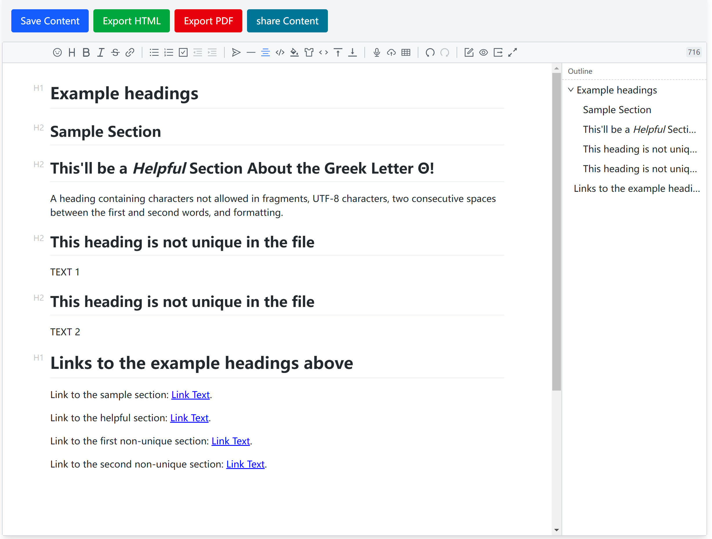

<!DOCTYPE html>
<!-- saved from url=(0021)https://mdeditor.net/ -->
<html lang="en" data-redeviation-bs-uid="oq3ih5uij2"><head><meta http-equiv="Content-Type" content="text/html; charset=UTF-8"><style>.ͼ1.cm-focused {outline: 1px dotted #212121;}
.ͼ1 {position: relative !important; box-sizing: border-box; display: flex !important; flex-direction: column;}
.ͼ1 .cm-scroller {display: flex !important; align-items: flex-start !important; font-family: monospace; line-height: 1.4; height: 100%; overflow-x: auto; position: relative; z-index: 0; overflow-anchor: none;}
.ͼ1 .cm-content[contenteditable=true] {-webkit-user-modify: read-write-plaintext-only;}
.ͼ1 .cm-content {margin: 0; flex-grow: 2; flex-shrink: 0; display: block; white-space: pre; word-wrap: normal; box-sizing: border-box; min-height: 100%; padding: 4px 0; outline: none;}
.ͼ1 .cm-lineWrapping {white-space: pre-wrap; white-space: break-spaces; word-break: break-word; overflow-wrap: anywhere; flex-shrink: 1;}
.ͼ2 .cm-content {caret-color: black;}
.ͼ3 .cm-content {caret-color: white;}
.ͼ1 .cm-line {display: block; padding: 0 2px 0 6px;}
.ͼ1 .cm-layer > * {position: absolute;}
.ͼ1 .cm-layer {position: absolute; left: 0; top: 0; contain: size style;}
.ͼ2 .cm-selectionBackground {background: #d9d9d9;}
.ͼ3 .cm-selectionBackground {background: #222;}
.ͼ2.cm-focused > .cm-scroller > .cm-selectionLayer .cm-selectionBackground {background: #d7d4f0;}
.ͼ3.cm-focused > .cm-scroller > .cm-selectionLayer .cm-selectionBackground {background: #233;}
.ͼ1 .cm-cursorLayer {pointer-events: none;}
.ͼ1.cm-focused > .cm-scroller > .cm-cursorLayer {animation: steps(1) cm-blink 1.2s infinite;}
@keyframes cm-blink {50% {opacity: 0;}}
@keyframes cm-blink2 {50% {opacity: 0;}}
.ͼ1 .cm-cursor, .ͼ1 .cm-dropCursor {border-left: 1.2px solid black; margin-left: -0.6px; pointer-events: none;}
.ͼ1 .cm-cursor {display: none;}
.ͼ3 .cm-cursor {border-left-color: #ddd;}
.ͼ1 .cm-dropCursor {position: absolute;}
.ͼ1.cm-focused > .cm-scroller > .cm-cursorLayer .cm-cursor {display: block;}
.ͼ1 .cm-iso {unicode-bidi: isolate;}
.ͼ1 .cm-announced {position: fixed; top: -10000px;}
@media print {.ͼ1 .cm-announced {display: none;}}
.ͼ2 .cm-activeLine {background-color: #cceeff44;}
.ͼ3 .cm-activeLine {background-color: #99eeff33;}
.ͼ2 .cm-specialChar {color: red;}
.ͼ3 .cm-specialChar {color: #f78;}
.ͼ1 .cm-gutters {flex-shrink: 0; display: flex; height: 100%; box-sizing: border-box; z-index: 200;}
.ͼ1 .cm-gutters-before {inset-inline-start: 0;}
.ͼ1 .cm-gutters-after {inset-inline-end: 0;}
.ͼ2 .cm-gutters.cm-gutters-before {border-right-width: 1px;}
.ͼ2 .cm-gutters.cm-gutters-after {border-left-width: 1px;}
.ͼ2 .cm-gutters {background-color: #f5f5f5; color: #6c6c6c; border: 0px solid #ddd;}
.ͼ3 .cm-gutters {background-color: #333338; color: #ccc;}
.ͼ1 .cm-gutter {display: flex !important; flex-direction: column; flex-shrink: 0; box-sizing: border-box; min-height: 100%; overflow: hidden;}
.ͼ1 .cm-gutterElement {box-sizing: border-box;}
.ͼ1 .cm-lineNumbers .cm-gutterElement {padding: 0 3px 0 5px; min-width: 20px; text-align: right; white-space: nowrap;}
.ͼ2 .cm-activeLineGutter {background-color: #e2f2ff;}
.ͼ3 .cm-activeLineGutter {background-color: #222227;}
.ͼ1 .cm-panels {box-sizing: border-box; position: sticky; left: 0; right: 0; z-index: 300;}
.ͼ2 .cm-panels {background-color: #f5f5f5; color: black;}
.ͼ2 .cm-panels-top {border-bottom: 1px solid #ddd;}
.ͼ2 .cm-panels-bottom {border-top: 1px solid #ddd;}
.ͼ3 .cm-panels {background-color: #333338; color: white;}
.ͼ1 .cm-dialog label {font-size: 80%;}
.ͼ1 .cm-dialog {padding: 2px 19px 4px 6px; position: relative;}
.ͼ1 .cm-dialog-close {position: absolute; top: 3px; right: 4px; background-color: inherit; border: none; font: inherit; font-size: 14px; padding: 0;}
.ͼ1 .cm-tab {display: inline-block; overflow: hidden; vertical-align: bottom;}
.ͼ1 .cm-widgetBuffer {vertical-align: text-top; height: 1em; width: 0; display: inline;}
.ͼ1 .cm-placeholder {color: #888; display: inline-block; vertical-align: top; user-select: none;}
.ͼ1 .cm-highlightSpace {background-image: radial-gradient(circle at 50% 55%, #aaa 20%, transparent 5%); background-position: center;}
.ͼ1 .cm-highlightTab {background-image: url('data:image/svg+xml,<svg xmlns="http://www.w3.org/2000/svg" width="200" height="20"><path stroke="%23888" stroke-width="1" fill="none" d="M1 10H196L190 5M190 15L196 10M197 4L197 16"/></svg>'); background-size: auto 100%; background-position: right 90%; background-repeat: no-repeat;}
.ͼ1 .cm-trailingSpace {background-color: #ff332255;}
.ͼ1 .cm-button {vertical-align: middle; color: inherit; font-size: 70%; padding: .2em 1em; border-radius: 1px;}
.ͼ2 .cm-button:active {background-image: linear-gradient(#b4b4b4, #d0d3d6);}
.ͼ2 .cm-button {background-image: linear-gradient(#eff1f5, #d9d9df); border: 1px solid #888;}
.ͼ3 .cm-button:active {background-image: linear-gradient(#111, #333);}
.ͼ3 .cm-button {background-image: linear-gradient(#393939, #111); border: 1px solid #888;}
.ͼ1 .cm-textfield {vertical-align: middle; color: inherit; font-size: 70%; border: 1px solid silver; padding: .2em .5em;}
.ͼ2 .cm-textfield {background-color: white;}
.ͼ3 .cm-textfield {border: 1px solid #555; background-color: inherit;}
.ͼ1 .cm-tooltip.cm-tooltip-autocomplete > ul > li, .ͼ1 .cm-tooltip.cm-tooltip-autocomplete > ul > completion-section {padding: 1px 3px; line-height: 1.2;}
.ͼ1 .cm-tooltip.cm-tooltip-autocomplete > ul > li {overflow-x: hidden; text-overflow: ellipsis; cursor: pointer;}
.ͼ1 .cm-tooltip.cm-tooltip-autocomplete > ul > completion-section {display: list-item; border-bottom: 1px solid silver; padding-left: 0.5em; opacity: 0.7;}
.ͼ1 .cm-tooltip.cm-tooltip-autocomplete > ul {font-family: monospace; white-space: nowrap; overflow: hidden auto; max-width: 700px; max-width: min(700px, 95vw); min-width: 250px; max-height: 10em; height: 100%; list-style: none; margin: 0; padding: 0;}
.ͼ2 .cm-tooltip-autocomplete ul li[aria-selected] {background: #17c; color: white;}
.ͼ2 .cm-tooltip-autocomplete-disabled ul li[aria-selected] {background: #777;}
.ͼ3 .cm-tooltip-autocomplete ul li[aria-selected] {background: #347; color: white;}
.ͼ3 .cm-tooltip-autocomplete-disabled ul li[aria-selected] {background: #444;}
.ͼ1 .cm-completionListIncompleteTop:before, .ͼ1 .cm-completionListIncompleteBottom:after {content: "···"; opacity: 0.5; display: block; text-align: center;}
.ͼ1 .cm-tooltip.cm-completionInfo {position: absolute; padding: 3px 9px; width: max-content; max-width: 400px; box-sizing: border-box; white-space: pre-line;}
.ͼ1 .cm-completionInfo.cm-completionInfo-left {right: 100%;}
.ͼ1 .cm-completionInfo.cm-completionInfo-right {left: 100%;}
.ͼ1 .cm-completionInfo.cm-completionInfo-left-narrow {right: 30px;}
.ͼ1 .cm-completionInfo.cm-completionInfo-right-narrow {left: 30px;}
.ͼ2 .cm-snippetField {background-color: #00000022;}
.ͼ3 .cm-snippetField {background-color: #ffffff22;}
.ͼ1 .cm-snippetFieldPosition {vertical-align: text-top; width: 0; height: 1.15em; display: inline-block; margin: 0 -0.7px -.7em; border-left: 1.4px dotted #888;}
.ͼ1 .cm-completionMatchedText {text-decoration: underline;}
.ͼ1 .cm-completionDetail {margin-left: 0.5em; font-style: italic;}
.ͼ1 .cm-completionIcon {font-size: 90%; width: .8em; display: inline-block; text-align: center; padding-right: .6em; opacity: 0.6; box-sizing: content-box;}
.ͼ1 .cm-completionIcon-function:after, .ͼ1 .cm-completionIcon-method:after {content: 'ƒ';}
.ͼ1 .cm-completionIcon-class:after {content: '○';}
.ͼ1 .cm-completionIcon-interface:after {content: '◌';}
.ͼ1 .cm-completionIcon-variable:after {content: '𝑥';}
.ͼ1 .cm-completionIcon-constant:after {content: '𝐶';}
.ͼ1 .cm-completionIcon-type:after {content: '𝑡';}
.ͼ1 .cm-completionIcon-enum:after {content: '∪';}
.ͼ1 .cm-completionIcon-property:after {content: '□';}
.ͼ1 .cm-completionIcon-keyword:after {content: '🔑︎';}
.ͼ1 .cm-completionIcon-namespace:after {content: '▢';}
.ͼ1 .cm-completionIcon-text:after {content: 'abc'; font-size: 50%; vertical-align: middle;}
.ͼ1 .cm-tooltip {z-index: 500; box-sizing: border-box;}
.ͼ2 .cm-tooltip {border: 1px solid #bbb; background-color: #f5f5f5;}
.ͼ2 .cm-tooltip-section:not(:first-child) {border-top: 1px solid #bbb;}
.ͼ3 .cm-tooltip {background-color: #333338; color: white;}
.ͼ1 .cm-tooltip-arrow:before, .ͼ1 .cm-tooltip-arrow:after {content: ''; position: absolute; width: 0; height: 0; border-left: 7px solid transparent; border-right: 7px solid transparent;}
.ͼ1 .cm-tooltip-above .cm-tooltip-arrow:before {border-top: 7px solid #bbb;}
.ͼ1 .cm-tooltip-above .cm-tooltip-arrow:after {border-top: 7px solid #f5f5f5; bottom: 1px;}
.ͼ1 .cm-tooltip-above .cm-tooltip-arrow {bottom: -7px;}
.ͼ1 .cm-tooltip-below .cm-tooltip-arrow:before {border-bottom: 7px solid #bbb;}
.ͼ1 .cm-tooltip-below .cm-tooltip-arrow:after {border-bottom: 7px solid #f5f5f5; top: 1px;}
.ͼ1 .cm-tooltip-below .cm-tooltip-arrow {top: -7px;}
.ͼ1 .cm-tooltip-arrow {height: 7px; width: 14px; position: absolute; z-index: -1; overflow: hidden;}
.ͼ3 .cm-tooltip .cm-tooltip-arrow:before {border-top-color: #333338; border-bottom-color: #333338;}
.ͼ3 .cm-tooltip .cm-tooltip-arrow:after {border-top-color: transparent; border-bottom-color: transparent;}
.ͼn {color: #c678dd;}
.ͼo {color: var(--md-color);}
.ͼp {color: #2d8cf0;}
.ͼq {color: #d19a66;}
.ͼr {color: #3f4a54;}
.ͼs {color: #e5c07b;}
.ͼt {color: #56b6c2;}
.ͼu {color: #2d8cf0;}
.ͼv {font-weight: bold;}
.ͼw {font-style: italic;}
.ͼx {text-decoration: line-through;}
.ͼy {color: #2d8cf0; text-decoration: underline;}
.ͼz {font-weight: bold; color: var(--md-color);}
.ͼ10 {color: #d19a66;}
.ͼ11 {color: #3f4a54;}
.ͼ12 {color: #fff;}
.ͼm {color: #3f4a54; background-color: var(--md-bk-color);}
.ͼm .cm-content {caret-color: #3f4a54;}
.ͼm .cm-cursor, .ͼm .cm-dropCursor {border-left-color: #3f4a54;}
.ͼm.cm-focused > .cm-scroller > .cm-selectionLayer .cm-selectionBackground, .ͼm .cm-selectionBackground, .ͼm .cm-content ::selection {background-color: #bad5fa;}
.ͼm .cm-panels {background-color: #f6f6f6; color: #3f4a54;}
.ͼm .cm-panels.cm-panels-top {border-bottom: 1px solid var(--md-border-color);}
.ͼm .cm-panels.cm-panels-bottom {border-top: 1px solid var(--md-border-color);}
.ͼm .cm-searchMatch {background-color: #72a1ff59; outline: 1px solid #457dff;}
.ͼm .cm-searchMatch.cm-searchMatch-selected {background-color: #6199ff2f;}
.ͼm .cm-activeLine {background-color: #ceedfa33;}
.ͼm .cm-selectionMatch {background-color: #aafe661a;}
.ͼm.cm-focused .cm-matchingBracket, .ͼm.cm-focused .cm-nonmatchingBracket {background-color: #bad0f847;}
.ͼm .cm-gutters {background-color: var(--md-bk-color); color: #3f4a54; border-right: 1px solid; border-color: var(--md-border-color);}
.ͼm .cm-activeLineGutter {background-color: #ceedfa33;}
.ͼm .cm-foldPlaceholder {background-color: transparent; border: none; color: #ddd;}
.ͼm .cm-tooltip {border: 1px solid var(--md-border-color); background-color: var(--md-bk-color);}
.ͼm .cm-tooltip .cm-tooltip-arrow:before {border-top-color: transparent; border-bottom-color: transparent;}
.ͼm .cm-tooltip .cm-tooltip-arrow:after {border-top-color: var(--md-bk-color); border-bottom-color: var(--md-bk-color);}
.ͼm .cm-tooltip-autocomplete > ul > li[aria-selected] {color: #3f4a54;}
.ͼ4 .cm-line ::selection, .ͼ4 .cm-line::selection {background-color: transparent !important;}
.ͼ4 .cm-line {caret-color: transparent !important;}
.ͼ4 .cm-content :focus::selection, .ͼ4 .cm-content :focus ::selection {background-color: Highlight !important;}
.ͼ4 .cm-content :focus {caret-color: initial !important;}
.ͼ4 .cm-content {caret-color: transparent !important;}
</style>
  
  <meta name="viewport" content="width=device-width, initial-scale=1.0">
  <meta name="theme-color" content="#f1f7fe">
  <meta name="apple-mobile-web-app-capable" content="yes">
  <meta name="mobile-web-app-capable" content="yes">
  <meta name="apple-mobile-web-app-status-bar-style" content="black">
  <title _msttexthash="35245665" _msthash="0">Онлайн-редактор разметки, форматирование и экспорт PDF — совместим с GitHub|mdeditor.net</title>
  <meta name="keywords" content="markdown editor, markdown editor online, github markdown, md editor, markdown formatter, online editor markdown, markdown, markdown online, markdown pdf">
  <meta name="description" content="mdeditor.net Online Markdown Editor with live preview, Markdown formatting, and export to PDF. Compatible with GitHub markdown. Easy to use and free!">
  <meta property="og:description" content="mdeditor.net Online Markdown Editor with live preview, Markdown formatting, and export to PDF. Compatible with GitHub markdown. Easy to use and free!">
  <meta name="twitter:description" property="og:description" itemprop="description" content="mdeditor.net Online Markdown Editor with live preview, Markdown formatting, and export to PDF. Compatible with GitHub markdown. Easy to use and free!">
  <meta property="og:title" content="Online Markdown Editor, Formatter &amp; PDF Export - GitHub Compatible">
  <meta property="og:site_name" content="mdeditor Markdown Editor">
  <meta property="og:url" content="https://mdeditor.net">
  <meta name="twitter:card" content="summary">
  <meta name="twitter:domain" content="mdeditor.net">
  <meta name="twitter:title" property="og:title" itemprop="mdeditor Markdown Editor" content="Online Markdown Editor, Formatter &amp; PDF Export - GitHub Compatible">
  <meta name="twitter:site" content="@mdeditor_net">
  <meta name="twitter:url" content="https://mdeditor.net">
  <meta property="og:image" content="https://mdeditor.net/v1/assets/images/logo.png">
  <meta name="twitter:image" content="https://mdeditor.net/v1/assets/images/logo.png"><link rel="alternate" hreflang="en" href="https://mdeditor.net/"><link rel="alternate" hreflang="zh" href="https://mdeditor.net/zh/"><link rel="alternate" hreflang="zh-tw" href="https://mdeditor.net/zh-tw/"><link rel="alternate" hreflang="fr" href="https://mdeditor.net/fr/"><link rel="alternate" hreflang="es" href="https://mdeditor.net/es/"><link rel="alternate" hreflang="de" href="https://mdeditor.net/de/"><link rel="alternate" hreflang="ko" href="https://mdeditor.net/kr/"><link rel="alternate" hreflang="pt" href="https://mdeditor.net/pt/"><link rel="alternate" hreflang="ru" href="https://mdeditor.net/ru/"><link rel="alternate" hreflang="sv" href="https://mdeditor.net/sv/"><script>
    var defaultLocale = 'en';
  </script>
  <script type="module" crossorigin="" src="./README_files/_plugin-vue_export-helper-vuBUBQnL.js.загрузка"></script>
  <script type="module" crossorigin="" src="./README_files/sv-SE-DP5Cl5GM.js.загрузка"></script>
  <script type="module" crossorigin="" src="./README_files/utils-C7WAkJoi.js.загрузка"></script>
  <script type="module" crossorigin="" src="./README_files/main-BuwtQjTJ.js.загрузка"></script>
  <link rel="stylesheet" crossorigin="" href="./README_files/_plugin-vue_export-helper-kQd06VHU.css">
  <link rel="stylesheet" crossorigin="" href="./README_files/utils-ByuuYRyI.css">
<style type="text/css">.medium-zoom-overlay{position:fixed;top:0;right:0;bottom:0;left:0;opacity:0;transition:opacity .3s;will-change:opacity}.medium-zoom--opened .medium-zoom-overlay{cursor:pointer;cursor:zoom-out;opacity:1}.medium-zoom-image{cursor:pointer;cursor:zoom-in;transition:transform .3s cubic-bezier(.2,0,.2,1)!important}.medium-zoom-image--hidden{visibility:hidden}.medium-zoom-image--opened{position:relative;cursor:pointer;cursor:zoom-out;will-change:transform}</style><script src="./README_files/screenfull.js.загрузка" id="md-editor-screenfull"></script><link href="./README_files/atom-one-dark.min.css" rel="stylesheet" id="md-editor-hlCss"><script src="./README_files/highlight.min.js.загрузка" id="md-editor-hljs"></script><script src="./README_files/katex.min.js.загрузка" id="md-editor-katex"></script><link rel="stylesheet" href="./README_files/katex.min.css" id="md-editor-katexCss"><script src="./README_files/mermaid.min.js.загрузка" id="md-editor-mermaid"></script><link rel="stylesheet" href="./README_files/cropper.min.css" id="md-editor-cropperCss"><script src="./README_files/cropper.min.js.загрузка" id="md-editor-cropper"></script><script src="./README_files/standalone.js.загрузка" id="md-editor-prettier"></script><script src="./README_files/markdown.js.загрузка" id="md-editor-prettierMD"></script></head>

<body class="bg-gray-50 min-h-screen" _msthidden="9">
  <div class="flex flex-col min-h-screen">
    <!-- Header -->
    <header class="bg-white shadow-sm">
      <div class="container mx-auto px-4 py-4 flex justify-between items-center">
        <div class="flex items-center space-x-2">
          <svg xmlns="http://www.w3.org/2000/svg" class="h-8 w-8 text-blue-600" fill="none" viewBox="0 0 24 24" stroke="currentColor">
            <path stroke-linecap="round" stroke-linejoin="round" stroke-width="2" d="M9 12h6m-6 4h6m2 5H7a2 2 0 01-2-2V5a2 2 0 012-2h5.586a1 1 0 01.707.293l5.414 5.414a1 1 0 01.293.707V19a2 2 0 01-2 2z"></path>
          </svg>
          <h1 class="text-xl font-bold text-gray-800" _msttexthash="1382602" _msthash="1">Редактор Markdown</h1>
        </div>
        <nav class="hidden md:flex space-x-6">
          <a href="https://mdeditor.net/#features" class="text-gray-600 hover:text-blue-600 transition-colors" _msttexthash="984971" _msthash="2">Функции</a>
          <a href="https://mdeditor.net/#how-to-use" class="text-gray-600 hover:text-blue-600 transition-colors" _msttexthash="2958709" _msthash="3">Как использовать</a>
          <a href="https://mdeditor.net/#faq" class="text-gray-600 hover:text-blue-600 transition-colors" _msttexthash="2666690" _msthash="4">Вопросы и ответы</a>
          <a href="https://mdeditor.net/en/docs.html" target="_blank" class="text-gray-600 hover:text-blue-600 transition-colors" _msttexthash="5361902" _msthash="5">Управление документами Markdown</a>
        </nav>
        <div>
          <button @click="toggleDarkMode" class="p-2 rounded-full hover:bg-gray-100 transition-colors">
            <svg xmlns="http://www.w3.org/2000/svg" class="h-5 w-5 text-gray-600" fill="none" viewBox="0 0 24 24" stroke="currentColor">
              <path stroke-linecap="round" stroke-linejoin="round" stroke-width="2" d="M20.354 15.354A9 9 0 018.646 3.646 9.003 9.003 0 0012 21a9.003 9.003 0 008.354-5.646z"></path>
            </svg>
          </button>
        </div>
        <div class="flex items-center gap-3">
          <div class="relative inline-block text-left mr-4">
            <button id="dropdownButton" class="inline-flex justify-center w-full px-4 py-2 text-sm font-medium text-gray-700 bg-white border border-gray-300 rounded-md shadow-sm hover:bg-gray-50 focus:outline-none">
              <svg class="w-5 h-5 mr-2">
                <use href="/assets/md/combined-EyeKuX8R.svg#en"></use>
              </svg><font _mstmutation="1" _msttexthash="1613534" _msthash="6">Английский</font><i class="fas fa-chevron-down ml-2 text-xs"></i>
            </button>
            <ul id="dropdownMenu" class="absolute hidden mt-1 w-48 bg-white border border-gray-300 rounded-lg shadow-lg z-10 top-full mb-1" _msthidden="11"><li class="text-left" _msthidden="1">
                <a href="https://mdeditor.net/zh/" class="flex items-center px-4 py-2 text-sm text-gray-700 hover:bg-gray-100 hover:text-gray-900" _msthidden="1">
                  <svg class="w-4 h-4 rounded-full">
                    <use href="/assets/md/combined-EyeKuX8R.svg#zh"></use>
                  </svg>
                  <span class="lang-text ml-2" _msttexthash="10709335" _msthidden="1" _msthash="7">简体中文</span>
                </a>
              </li><li class="text-left" _msthidden="1">
                <a href="https://mdeditor.net/zh-tw/" class="flex items-center px-4 py-2 text-sm text-gray-700 hover:bg-gray-100 hover:text-gray-900" _msthidden="1">
                  <svg class="w-4 h-4 rounded-full">
                    <use href="/assets/md/combined-EyeKuX8R.svg#zh-tw"></use>
                  </svg>
                  <span class="lang-text ml-2" _msttexthash="12783706" _msthidden="1" _msthash="8">繁體中文</span>
                </a>
              </li><li class="text-left" _msthidden="1">
                <a href="https://mdeditor.net/fr/" class="flex items-center px-4 py-2 text-sm text-gray-700 hover:bg-gray-100 hover:text-gray-900" _msthidden="1">
                  <svg class="w-4 h-4 rounded-full">
                    <use href="/assets/md/combined-EyeKuX8R.svg#fr"></use>
                  </svg>
                  <span class="lang-text ml-2" _msttexthash="130715" _msthidden="1" _msthash="9">Français</span>
                </a>
              </li><li class="text-left" _msthidden="1">
                <a href="https://mdeditor.net/es/" class="flex items-center px-4 py-2 text-sm text-gray-700 hover:bg-gray-100 hover:text-gray-900" _msthidden="1">
                  <svg class="w-4 h-4 rounded-full">
                    <use href="/assets/md/combined-EyeKuX8R.svg#es"></use>
                  </svg>
                  <span class="lang-text ml-2" _msttexthash="113984" _msthidden="1" _msthash="10">Español</span>
                </a>
              </li><li class="text-left" _msthidden="1">
                <a href="https://mdeditor.net/de/" class="flex items-center px-4 py-2 text-sm text-gray-700 hover:bg-gray-100 hover:text-gray-900" _msthidden="1">
                  <svg class="w-4 h-4 rounded-full">
                    <use href="/assets/md/combined-EyeKuX8R.svg#de"></use>
                  </svg>
                  <span class="lang-text ml-2" _msttexthash="94926" _msthidden="1" _msthash="11">Deutsch</span>
                </a>
              </li><li class="text-left" _msthidden="1">
                <a href="https://mdeditor.net/jp/" class="flex items-center px-4 py-2 text-sm text-gray-700 hover:bg-gray-100 hover:text-gray-900" _msthidden="1">
                  <svg class="w-4 h-4 rounded-full">
                    <use href="/assets/md/combined-EyeKuX8R.svg#jp"></use>
                  </svg>
                  <span class="lang-text ml-2" _msttexthash="9272445" _msthidden="1" _msthash="12">日本語</span>
                </a>
              </li><li class="text-left" _msthidden="1">
                <a href="https://mdeditor.net/kr/" class="flex items-center px-4 py-2 text-sm text-gray-700 hover:bg-gray-100 hover:text-gray-900" _msthidden="1">
                  <svg class="w-4 h-4 rounded-full">
                    <use href="/assets/md/combined-EyeKuX8R.svg#ko"></use>
                  </svg>
                  <span class="lang-text ml-2" _msttexthash="15509312" _msthidden="1" _msthash="13">한국어</span>
                </a>
              </li><li class="text-left" _msthidden="1">
                <a href="https://mdeditor.net/pt/" class="flex items-center px-4 py-2 text-sm text-gray-700 hover:bg-gray-100 hover:text-gray-900" _msthidden="1">
                  <svg class="w-4 h-4 rounded-full">
                    <use href="/assets/md/combined-EyeKuX8R.svg#pt"></use>
                  </svg>
                  <span class="lang-text ml-2" _msttexthash="164827" _msthidden="1" _msthash="14">Português</span>
                </a>
              </li><li class="text-left" _msthidden="1">
                <a href="https://mdeditor.net/ru/" class="flex items-center px-4 py-2 text-sm text-gray-700 hover:bg-gray-100 hover:text-gray-900" _msthidden="1">
                  <svg class="w-4 h-4 rounded-full">
                    <use href="/assets/md/combined-EyeKuX8R.svg#ru"></use>
                  </svg>
                  <span class="lang-text ml-2" _msttexthash="984438" _msthidden="1" _msthash="15">Русский</span>
                </a>
              </li><li class="text-left" _msthidden="1">
                <a href="https://mdeditor.net/sv/" class="flex items-center px-4 py-2 text-sm text-gray-700 hover:bg-gray-100 hover:text-gray-900" _msthidden="1">
                  <svg class="w-4 h-4 rounded-full">
                    <use href="/assets/md/combined-EyeKuX8R.svg#sv"></use>
                  </svg>
                  <span class="lang-text ml-2" _msttexthash="95472" _msthidden="1" _msthash="16">Svenska</span>
                </a>
              </li><li class="text-left" _msthidden="1">
                <a href="https://mdeditor.net/en/" class="flex items-center px-4 py-2 text-sm text-gray-700 hover:bg-gray-100 hover:text-gray-900" _msthidden="1">
                  <svg class="w-4 h-4 rounded-full">
                    <use href="/assets/md/combined-EyeKuX8R.svg#en"></use>
                  </svg>
                  <span class="lang-text ml-2" _msttexthash="94341" _msthidden="1" _msthash="17">English</span>
                </a>
              </li></ul>
          </div>
        </div>
      </div>
    </header>

    <!-- Hero Section -->
    <section class="bg-gradient-to-r from-blue-500 to-purple-600 py-16 text-white">
      <div class="container mx-auto px-4 text-center">
        <h1 class="text-4xl md:text-5xl font-bold mb-4" _msttexthash="3055741" _msthash="18">Онлайн-редактор Markdown</h1>
        <p class="text-xl md:text-2xl mb-8 max-w-2xl mx-auto" _msttexthash="27104077" _msthash="19">Пишите, просматривайте и экспортируйте документы Markdown с лёгкостью</p>
        <div class="flex justify-center space-x-4">
          <a href="https://mdeditor.net/#app" class="bg-white text-blue-600 px-6 py-3 rounded-lg font-medium shadow-md hover:shadow-lg transition-shadow" _msttexthash="2957383" _msthash="20">Начинайте писать</a>
          <a href="https://mdeditor.net/#how-to-use" class="bg-transparent border-2 border-white px-6 py-3 rounded-lg font-medium hover:bg-white hover:text-blue-600 transition-colors" _msttexthash="1388361" _msthash="21">Подробнее</a></div>
      </div>
    </section>

    <!-- Editor Section -->
    <section id="Tools" class="pt-8 bg-white">
      <div class="container mx-auto px-4">
        <div class="bg-white p-6 rounded-lg shadow-md col-span-2">
          <div class="text-blue-600 mb-4 flex items-center">
            <h3 class="text-xl font-semibold mb-2" _msttexthash="2098980" _msthash="22">Инструменты Markdown</h3>
          </div>
          <div class="flex items-center space-x-1"><a href="https://mdeditor.net/mkdocs.html" target="_blank" class="inline-flex items-center px-3 py-2 text-sm font-medium text-gray-700 bg-white border border-gray-300 rounded-md hover:bg-gray-50 hover:text-gray-900 focus:outline-none focus:ring-2 focus:ring-offset-2 focus:ring-blue-500 transition-colors" _msttexthash="72618" _msthash="23">MkDocs</a><a href="https://mdeditor.net/viewer.html" target="_blank" class="inline-flex items-center px-3 py-2 text-sm font-medium text-gray-700 bg-white border border-gray-300 rounded-md hover:bg-gray-50 hover:text-gray-900 focus:outline-none focus:ring-2 focus:ring-offset-2 focus:ring-blue-500 transition-colors" _msttexthash="1846598" _msthash="24">Смотритель Markdown</a><a href="https://mdeditor.net/preview.html" target="_blank" class="inline-flex items-center px-3 py-2 text-sm font-medium text-gray-700 bg-white border border-gray-300 rounded-md hover:bg-gray-50 hover:text-gray-900 focus:outline-none focus:ring-2 focus:ring-offset-2 focus:ring-blue-500 transition-colors" _msttexthash="985218" _msthash="25">Превью Markdown</a><a href="https://marketplace.visualstudio.com/items/?itemName=idreamsoft.vscode-mdeditor" target="_blank" class="inline-flex items-center px-3 py-2 text-sm font-medium text-gray-700 bg-white border border-gray-300 rounded-md hover:bg-gray-50 hover:text-gray-900 focus:outline-none focus:ring-2 focus:ring-offset-2 focus:ring-blue-500 transition-colors" _msttexthash="15416063" _msthash="26">Редактор и предпросмотр Markdown — расширение VS Code</a><a href="https://mdeditor.net/editor.html" target="_blank" class="inline-flex items-center px-3 py-2 text-sm font-medium text-gray-700 bg-white border border-gray-300 rounded-md hover:bg-gray-50 hover:text-gray-900 focus:outline-none focus:ring-2 focus:ring-offset-2 focus:ring-blue-500 transition-colors" _msttexthash="1382602" _msthash="27">Редактор Markdown</a><a href="https://mdeditor.net/markdown-to-pdf.html" target="_blank" class="inline-flex items-center px-3 py-2 text-sm font-medium text-gray-700 bg-white border border-gray-300 rounded-md hover:bg-gray-50 hover:text-gray-900 focus:outline-none focus:ring-2 focus:ring-offset-2 focus:ring-blue-500 transition-colors" _msttexthash="1455454" _msthash="28">Разметка в pdf</a><a href="https://mdeditor.net/markdown-to-word.html" target="_blank" class="inline-flex items-center px-3 py-2 text-sm font-medium text-gray-700 bg-white border border-gray-300 rounded-md hover:bg-gray-50 hover:text-gray-900 focus:outline-none focus:ring-2 focus:ring-offset-2 focus:ring-blue-500 transition-colors" _msttexthash="4274998" _msthash="29">Снижение цены до слова</a></div>
        </div>        
      </div>
    </section>
    <section id="editor" class="pt-8 bg-white">
      <div class="container mx-auto px-4">
        <h2 class="text-3xl font-bold text-center mb-8" _msttexthash="2957383" _msthash="30">Начинайте писать</h2>
        <p class="text-center text-gray-600 mb-8 max-w-2xl mx-auto" _msttexthash="105671241" _msthash="31">Напишите свой Markdown слева и посмотрите отформатированный превью справа. Ваш контент сохраняется автоматически по мере набора текста.</p>

        <!-- Placeholder for your existing editor component -->
        <div class="overflow-hidden shadow-lg">
          <div class="flex flex-col">
            <div id="app" style="min-height: 80vh;" data-v-app=""><!----><!----><div class="bg-white border-b border-gray-200 px-4 py-3 shadow-sm"><div class="flex items-center justify-between"><div class="flex items-center space-x-1"><button class="inline-flex items-center px-3 py-2 text-sm font-medium text-gray-700 bg-white border border-gray-300 rounded-md hover:bg-gray-50 hover:text-gray-900 focus:outline-none focus:ring-2 focus:ring-offset-2 focus:ring-blue-500 transition-colors" title="Save Content"><svg class="w-4 h-4 mr-2" fill="none" stroke="currentColor" viewBox="0 0 24 24"><path stroke-linecap="round" stroke-linejoin="round" stroke-width="2" d="M8 7H5a2 2 0 00-2 2v9a2 2 0 002 2h14a2 2 0 002-2V9a2 2 0 00-2-2h-3m-1 4l-3-3m0 0l-3 3m3-3v12"></path></svg><font _mstmutation="1" _msttexthash="3272555" _msthash="142"> Сохранить контент</font></button><div class="relative inline-block text-left"><button class="inline-flex items-center px-3 py-2 text-sm font-medium text-gray-700 bg-white border border-gray-300 rounded-md hover:bg-gray-50 hover:text-gray-900 focus:outline-none focus:ring-2 focus:ring-offset-2 focus:ring-blue-500 transition-colors"><svg class="w-4 h-4 mr-2" fill="none" stroke="currentColor" viewBox="0 0 24 24"><path stroke-linecap="round" stroke-linejoin="round" stroke-width="2" d="M12 10v6m0 0l-3-3m3 3l3-3m2 8H7a2 2 0 01-2-2V5a2 2 0 012-2h5.586a1 1 0 01.707.293l5.414 5.414a1 1 0 01.293.707V19a2 2 0 01-2 2z"></path></svg><font _mstmutation="1" _msttexthash="987766" _msthash="143"> Экспорт </font><svg class="w-4 h-4 ml-1" fill="none" stroke="currentColor" viewBox="0 0 24 24"><path stroke-linecap="round" stroke-linejoin="round" stroke-width="2" d="M19 9l-7 7-7-7"></path></svg></button><div class="absolute left-0 mt-2 w-48 rounded-md shadow-lg bg-white ring-1 ring-black ring-opacity-5 focus:outline-none z-10" style="display: none;" _mstvisible="0"><div class="py-1" _mstvisible="1"><button class="group flex items-center px-4 py-2 text-sm text-gray-700 hover:bg-gray-100 hover:text-gray-900 w-full text-left" _mstvisible="2"><svg class="w-4 h-4 mr-3 text-gray-400 group-hover:text-gray-500" fill="none" stroke="currentColor" viewBox="0 0 24 24" _mstVisible="3"><path stroke-linecap="round" stroke-linejoin="round" stroke-width="2" d="M10 20l4-16m4 4l4 4-4 4M6 16l-4-4 4-4" _mstVisible="4"></path></svg><font _mstmutation="1" _msttexthash="1050062" _msthash="144" _mstvisible="3"> Экспорт HTML</font></button><button class="group flex items-center px-4 py-2 text-sm text-gray-700 hover:bg-gray-100 hover:text-gray-900 w-full text-left" _mstvisible="2"><svg class="w-4 h-4 mr-3 text-gray-400 group-hover:text-gray-500" fill="none" stroke="currentColor" viewBox="0 0 24 24" _mstVisible="3"><path stroke-linecap="round" stroke-linejoin="round" stroke-width="2" d="M9 12h6m-6 4h6m2 5H7a2 2 0 01-2-2V5a2 2 0 012-2h5.586a1 1 0 01.707.293l5.414 5.414a1 1 0 01.293.707V19a2 2 0 01-2 2z" _mstVisible="4"></path></svg><font _mstmutation="1" _msttexthash="1030146" _msthash="145" _mstvisible="3"> Экспорт PDF</font></button><button class="group flex items-center px-4 py-2 text-sm text-gray-700 hover:bg-gray-100 hover:text-gray-900 w-full text-left" _mstvisible="2"><svg class="w-4 h-4 mr-3 text-gray-400 group-hover:text-gray-500" fill="none" stroke="currentColor" viewBox="0 0 24 24" _mstVisible="3"><path stroke-linecap="round" stroke-linejoin="round" stroke-width="2" d="M4 16l4.586-4.586a2 2 0 012.828 0L16 16m-2-2l1.586-1.586a2 2 0 012.828 0L20 14m-6-6h.01M6 20h12a2 2 0 002-2V6a2 2 0 00-2-2H6a2 2 0 00-2 2v12a2 2 0 002 2z" _mstVisible="4"></path></svg><font _mstmutation="1" _msttexthash="5017064" _msthash="146" _mstvisible="3"> Экспортное изображение</font></button><button class="group flex items-center px-4 py-2 text-sm text-gray-700 hover:bg-gray-100 hover:text-gray-900 w-full text-left" _mstvisible="2"><svg class="w-4 h-4 mr-3 text-gray-400 group-hover:text-gray-500" fill="none" stroke="currentColor" viewBox="0 0 24 24" _mstVisible="3"><path stroke-linecap="round" stroke-linejoin="round" stroke-width="2" d="M9 12h6m-6 4h6m2 5H7a2 2 0 01-2-2V5a2 2 0 012-2h5.586a1 1 0 01.707.293l5.414 5.414a1 1 0 01.293.707V19a2 2 0 01-2 2z" _mstVisible="4"></path></svg><font _mstmutation="1" _msttexthash="2959073" _msthash="147" _mstvisible="3"> Экспортное слово</font></button></div></div></div><div class="relative inline-block text-left"><button class="inline-flex items-center px-3 py-2 text-sm font-medium text-gray-700 bg-white border border-gray-300 rounded-md hover:bg-gray-50 hover:text-gray-900 focus:outline-none focus:ring-2 focus:ring-offset-2 focus:ring-green-500 transition-colors"><svg class="w-4 h-4 mr-2" fill="none" stroke="currentColor" viewBox="0 0 24 24"><path stroke-linecap="round" stroke-linejoin="round" stroke-width="2" d="M7 16a4 4 0 01-.88-7.903A5 5 0 1115.9 6L16 6a5 5 0 011 9.9M9 19l3 3m0 0l3-3m-3 3V10"></path></svg><font _mstmutation="1" _msttexthash="802087" _msthash="148"> Импорт </font><svg class="w-4 h-4 ml-1" fill="none" stroke="currentColor" viewBox="0 0 24 24"><path stroke-linecap="round" stroke-linejoin="round" stroke-width="2" d="M19 9l-7 7-7-7"></path></svg></button><div class="absolute left-0 mt-2 w-48 rounded-md shadow-lg bg-white ring-1 ring-black ring-opacity-5 focus:outline-none z-10" style="display: none;" _msthidden="3"><div class="py-1" _msthidden="3"><label class="group flex items-center px-4 py-2 text-sm text-gray-700 hover:bg-gray-100 hover:text-gray-900 w-full text-left cursor-pointer" _msthidden="1"><svg class="w-4 h-4 mr-3 text-gray-400 group-hover:text-gray-500" fill="none" stroke="currentColor" viewBox="0 0 24 24"><path stroke-linecap="round" stroke-linejoin="round" stroke-width="2" d="M9 12h6m-6 4h6m2 5H7a2 2 0 01-2-2V5a2 2 0 012-2h5.586a1 1 0 01.707.293l5.414 5.414a1 1 0 01.293.707V19a2 2 0 01-2 2z"></path></svg><font _mstmutation="1" _msttexthash="119457" _msthidden="1" _msthash="149"> Import PDF </font><input type="file" accept=".pdf" class="hidden"></label><label class="group flex items-center px-4 py-2 text-sm text-gray-700 hover:bg-gray-100 hover:text-gray-900 w-full text-left cursor-pointer" _msthidden="1"><svg class="w-4 h-4 mr-3 text-gray-400 group-hover:text-gray-500" fill="none" stroke="currentColor" viewBox="0 0 24 24"><path stroke-linecap="round" stroke-linejoin="round" stroke-width="2" d="M9 12h6m-6 4h6m2 5H7a2 2 0 01-2-2V5a2 2 0 012-2h5.586a1 1 0 01.707.293l5.414 5.414a1 1 0 01.293.707V19a2 2 0 01-2 2z"></path></svg><font _mstmutation="1" _msttexthash="157846" _msthidden="1" _msthash="150"> Import Word </font><input type="file" accept=".doc,.docx" class="hidden"></label><label class="group flex items-center px-4 py-2 text-sm text-gray-700 hover:bg-gray-100 hover:text-gray-900 w-full text-left cursor-pointer" _msthidden="1"><svg class="w-4 h-4 mr-3 text-gray-400 group-hover:text-gray-500" fill="none" stroke="currentColor" viewBox="0 0 24 24"><path stroke-linecap="round" stroke-linejoin="round" stroke-width="2" d="M3 7v10a2 2 0 002 2h14a2 2 0 002-2V9a2 2 0 00-2-2H5a2 2 0 00-2 2z"></path></svg><font _mstmutation="1" _msttexthash="177593" _msthidden="1" _msthash="151"> Import Excel </font><input type="file" accept=".xls,.xlsx" class="hidden"></label></div></div></div><button class="inline-flex items-center px-3 py-2 text-sm font-medium text-gray-700 bg-white border border-gray-300 rounded-md hover:bg-gray-50 hover:text-gray-900 focus:outline-none focus:ring-2 focus:ring-offset-2 focus:ring-blue-500 transition-colors" title="Share Content"><svg class="w-4 h-4 mr-2" fill="none" stroke="currentColor" viewBox="0 0 24 24"><path stroke-linecap="round" stroke-linejoin="round" stroke-width="2" d="M8.684 13.342C8.886 12.938 9 12.482 9 12c0-.482-.114-.938-.316-1.342m0 2.684a3 3 0 110-2.684m0 2.684l6.632 3.316m-6.632-6l6.632-3.316m0 0a3 3 0 105.367-2.684 3 3 0 00-5.367 2.684zm0 9.316a3 3 0 105.367 2.684 3 3 0 00-5.367-2.684z"></path></svg><font _mstmutation="1" _msttexthash="3598504" _msthash="152"> Делиться контентом</font></button></div></div></div><div id="md-editor" class="md-editor" style="height: 92vh;" _msthidden="1"><div class="md-editor-toolbar-wrapper" id="md-editor-toolbar-wrapper"><div class="md-editor-toolbar"><div class="md-editor-toolbar-left"><div class="md-editor-toolbar-item" title="bold"><svg xmlns="http://www.w3.org/2000/svg" width="24" height="24" viewBox="0 0 24 24" fill="none" stroke="currentColor" stroke-width="2" stroke-linecap="round" stroke-linejoin="round" class="lucide lucide-bold-icon md-editor-icon"><path d="M6 12h9a4 4 0 0 1 0 8H7a1 1 0 0 1-1-1V5a1 1 0 0 1 1-1h7a4 4 0 0 1 0 8"></path></svg><!----></div><div class="md-editor-toolbar-item" title="underline"><svg xmlns="http://www.w3.org/2000/svg" width="24" height="24" viewBox="0 0 24 24" fill="none" stroke="currentColor" stroke-width="2" stroke-linecap="round" stroke-linejoin="round" class="lucide lucide-underline-icon md-editor-icon"><path d="M6 4v6a6 6 0 0 0 12 0V4"></path><line x1="4" x2="20" y1="20" y2="20"></line></svg><!----></div><div class="md-editor-toolbar-item" title="italic"><svg xmlns="http://www.w3.org/2000/svg" width="24" height="24" viewBox="0 0 24 24" fill="none" stroke="currentColor" stroke-width="2" stroke-linecap="round" stroke-linejoin="round" class="lucide lucide-italic-icon md-editor-icon"><line x1="19" x2="10" y1="4" y2="4"></line><line x1="14" x2="5" y1="20" y2="20"></line><line x1="15" x2="9" y1="4" y2="20"></line></svg><!----></div><div class="md-editor-divider"></div><div class="md-editor-toolbar-item" title="title"><svg xmlns="http://www.w3.org/2000/svg" width="24" height="24" viewBox="0 0 24 24" fill="none" stroke="currentColor" stroke-width="2" stroke-linecap="round" stroke-linejoin="round" class="lucide lucide-heading-icon md-editor-icon"><path d="M6 12h12"></path><path d="M6 20V4"></path><path d="M18 20V4"></path></svg><!----></div><div class="md-editor-dropdown md-editor-dropdown-hidden"><div class="md-editor-dropdown-overlay"><ul class="md-editor-menu" role="menu"><li class="md-editor-menu-item md-editor-menu-item-title" role="menuitem" tabindex="0" _msttexthash="5422521" _msthash="119">Заголовок первого уровня</li><li class="md-editor-menu-item md-editor-menu-item-title" role="menuitem" tabindex="0" _msttexthash="5425680" _msthash="120">Заголовок второго уровня</li><li class="md-editor-menu-item md-editor-menu-item-title" role="menuitem" tabindex="0" _msttexthash="2972736" _msthash="121">Заголовок уровня 3</li><li class="md-editor-menu-item md-editor-menu-item-title" role="menuitem" tabindex="0" _msttexthash="3838107" _msthash="122">Заголовок 4-го уровня</li><li class="md-editor-menu-item md-editor-menu-item-title" role="menuitem" tabindex="0" _msttexthash="2973308" _msthash="123">Заголовок уровня 5</li><li class="md-editor-menu-item md-editor-menu-item-title" role="menuitem" tabindex="0" _msttexthash="3838523" _msthash="124">Заголовок 6-го уровня</li></ul></div></div><div class="md-editor-toolbar-item" title="strikeThrough"><svg xmlns="http://www.w3.org/2000/svg" width="24" height="24" viewBox="0 0 24 24" fill="none" stroke="currentColor" stroke-width="2" stroke-linecap="round" stroke-linejoin="round" class="lucide lucide-strikethrough-icon md-editor-icon"><path d="M16 4H9a3 3 0 0 0-2.83 4"></path><path d="M14 12a4 4 0 0 1 0 8H6"></path><line x1="4" x2="20" y1="12" y2="12"></line></svg><!----></div><div class="md-editor-toolbar-item" title="subscript"><svg xmlns="http://www.w3.org/2000/svg" width="24" height="24" viewBox="0 0 24 24" fill="none" stroke="currentColor" stroke-width="2" stroke-linecap="round" stroke-linejoin="round" class="lucide lucide-subscript-icon md-editor-icon"><path d="m4 5 8 8"></path><path d="m12 5-8 8"></path><path d="M20 19h-4c0-1.5.44-2 1.5-2.5S20 15.33 20 14c0-.47-.17-.93-.48-1.29a2.11 2.11 0 0 0-2.62-.44c-.42.24-.74.62-.9 1.07"></path></svg><!----></div><div class="md-editor-toolbar-item" title="superscript"><svg xmlns="http://www.w3.org/2000/svg" width="24" height="24" viewBox="0 0 24 24" fill="none" stroke="currentColor" stroke-width="2" stroke-linecap="round" stroke-linejoin="round" class="lucide lucide-superscript-icon md-editor-icon"><path d="m4 19 8-8"></path><path d="m12 19-8-8"></path><path d="M20 12h-4c0-1.5.442-2 1.5-2.5S20 8.334 20 7.002c0-.472-.17-.93-.484-1.29a2.105 2.105 0 0 0-2.617-.436c-.42.239-.738.614-.899 1.06"></path></svg><!----></div><div class="md-editor-toolbar-item" title="quote"><svg xmlns="http://www.w3.org/2000/svg" width="24" height="24" viewBox="0 0 24 24" fill="none" stroke="currentColor" stroke-width="2" stroke-linecap="round" stroke-linejoin="round" class="lucide lucide-quote-icon md-editor-icon"><path d="M16 3a2 2 0 0 0-2 2v6a2 2 0 0 0 2 2 1 1 0 0 1 1 1v1a2 2 0 0 1-2 2 1 1 0 0 0-1 1v2a1 1 0 0 0 1 1 6 6 0 0 0 6-6V5a2 2 0 0 0-2-2z"></path><path d="M5 3a2 2 0 0 0-2 2v6a2 2 0 0 0 2 2 1 1 0 0 1 1 1v1a2 2 0 0 1-2 2 1 1 0 0 0-1 1v2a1 1 0 0 0 1 1 6 6 0 0 0 6-6V5a2 2 0 0 0-2-2z"></path></svg><!----></div><div class="md-editor-toolbar-item" title="unordered list"><svg xmlns="http://www.w3.org/2000/svg" width="24" height="24" viewBox="0 0 24 24" fill="none" stroke="currentColor" stroke-width="2" stroke-linecap="round" stroke-linejoin="round" class="lucide lucide-list-icon md-editor-icon"><path d="M3 12h.01"></path><path d="M3 18h.01"></path><path d="M3 6h.01"></path><path d="M8 12h13"></path><path d="M8 18h13"></path><path d="M8 6h13"></path></svg><!----></div><div class="md-editor-toolbar-item" title="ordered list"><svg xmlns="http://www.w3.org/2000/svg" width="24" height="24" viewBox="0 0 24 24" fill="none" stroke="currentColor" stroke-width="2" stroke-linecap="round" stroke-linejoin="round" class="lucide lucide-list-ordered-icon md-editor-icon"><path d="M10 12h11"></path><path d="M10 18h11"></path><path d="M10 6h11"></path><path d="M4 10h2"></path><path d="M4 6h1v4"></path><path d="M6 18H4c0-1 2-2 2-3s-1-1.5-2-1"></path></svg><!----></div><div class="md-editor-toolbar-item" title="task list"><svg xmlns="http://www.w3.org/2000/svg" width="24" height="24" viewBox="0 0 24 24" fill="none" stroke="currentColor" stroke-width="2" stroke-linecap="round" stroke-linejoin="round" class="lucide lucide-list-todo-icon md-editor-icon"><rect x="3" y="5" width="6" height="6" rx="1"></rect><path d="m3 17 2 2 4-4"></path><path d="M13 6h8"></path><path d="M13 12h8"></path><path d="M13 18h8"></path></svg><!----></div><div class="md-editor-divider"></div><div class="md-editor-toolbar-item" title="inline code"><svg xmlns="http://www.w3.org/2000/svg" width="24" height="24" viewBox="0 0 24 24" fill="none" stroke="currentColor" stroke-width="2" stroke-linecap="round" stroke-linejoin="round" class="lucide lucide-code-icon md-editor-icon"><polyline points="16 18 22 12 16 6"></polyline><polyline points="8 6 2 12 8 18"></polyline></svg><!----></div><div class="md-editor-toolbar-item" title="block-level code"><svg xmlns="http://www.w3.org/2000/svg" width="24" height="24" viewBox="0 0 24 24" fill="none" stroke="currentColor" stroke-width="2" stroke-linecap="round" stroke-linejoin="round" class="lucide lucide-square-code-icon md-editor-icon"><path d="M10 9.5 8 12l2 2.5"></path><path d="m14 9.5 2 2.5-2 2.5"></path><rect width="18" height="18" x="3" y="3" rx="2"></rect></svg><!----></div><div class="md-editor-toolbar-item" title="link"><svg xmlns="http://www.w3.org/2000/svg" width="24" height="24" viewBox="0 0 24 24" fill="none" stroke="currentColor" stroke-width="2" stroke-linecap="round" stroke-linejoin="round" class="lucide lucide-link-icon md-editor-icon"><path d="M10 13a5 5 0 0 0 7.54.54l3-3a5 5 0 0 0-7.07-7.07l-1.72 1.71"></path><path d="M14 11a5 5 0 0 0-7.54-.54l-3 3a5 5 0 0 0 7.07 7.07l1.71-1.71"></path></svg><!----></div><div class="md-editor-toolbar-item" title="image"><svg xmlns="http://www.w3.org/2000/svg" width="24" height="24" viewBox="0 0 24 24" fill="none" stroke="currentColor" stroke-width="2" stroke-linecap="round" stroke-linejoin="round" class="lucide lucide-image-icon md-editor-icon"><rect width="18" height="18" x="3" y="3" rx="2" ry="2"></rect><circle cx="9" cy="9" r="2"></circle><path d="m21 15-3.086-3.086a2 2 0 0 0-2.828 0L6 21"></path></svg><!----></div><div class="md-editor-dropdown md-editor-dropdown-hidden" style="top: 28.9844px; left: 389.49px;"><div class="md-editor-dropdown-overlay"><ul class="md-editor-menu" role="menu"><li class="md-editor-menu-item md-editor-menu-item-image" role="menuitem" tabindex="0" _msttexthash="7590492" _msthash="125">Добавить ссылку на изображение</li><li class="md-editor-menu-item md-editor-menu-item-image" role="menuitem" tabindex="0" _msttexthash="4644172" _msthash="126">Загрузить изображения</li><li class="md-editor-menu-item md-editor-menu-item-image" role="menuitem" tabindex="0" _msttexthash="3930810" _msthash="127">Вырезать и загрузить</li></ul></div></div><div class="md-editor-toolbar-item" title="table"><svg xmlns="http://www.w3.org/2000/svg" width="24" height="24" viewBox="0 0 24 24" fill="none" stroke="currentColor" stroke-width="2" stroke-linecap="round" stroke-linejoin="round" class="lucide lucide-table-icon md-editor-icon"><path d="M12 3v18"></path><rect width="18" height="18" x="3" y="3" rx="2"></rect><path d="M3 9h18"></path><path d="M3 15h18"></path></svg><!----></div><div class="md-editor-dropdown md-editor-dropdown-hidden" style="top: 28.9844px; left: 469.49px;"><div class="md-editor-dropdown-overlay"><div class="md-editor-table-shape"><div class="md-editor-table-shape-row"><div class="md-editor-table-shape-col"><div class="md-editor-table-shape-col-default"></div></div><div class="md-editor-table-shape-col"><div class="md-editor-table-shape-col-default"></div></div><div class="md-editor-table-shape-col"><div class="md-editor-table-shape-col-default"></div></div><div class="md-editor-table-shape-col"><div class="md-editor-table-shape-col-default"></div></div><div class="md-editor-table-shape-col"><div class="md-editor-table-shape-col-default"></div></div><div class="md-editor-table-shape-col"><div class="md-editor-table-shape-col-default"></div></div></div><div class="md-editor-table-shape-row"><div class="md-editor-table-shape-col"><div class="md-editor-table-shape-col-default"></div></div><div class="md-editor-table-shape-col"><div class="md-editor-table-shape-col-default"></div></div><div class="md-editor-table-shape-col"><div class="md-editor-table-shape-col-default"></div></div><div class="md-editor-table-shape-col"><div class="md-editor-table-shape-col-default"></div></div><div class="md-editor-table-shape-col"><div class="md-editor-table-shape-col-default"></div></div><div class="md-editor-table-shape-col"><div class="md-editor-table-shape-col-default"></div></div></div><div class="md-editor-table-shape-row"><div class="md-editor-table-shape-col"><div class="md-editor-table-shape-col-default"></div></div><div class="md-editor-table-shape-col"><div class="md-editor-table-shape-col-default"></div></div><div class="md-editor-table-shape-col"><div class="md-editor-table-shape-col-default"></div></div><div class="md-editor-table-shape-col"><div class="md-editor-table-shape-col-default"></div></div><div class="md-editor-table-shape-col"><div class="md-editor-table-shape-col-default"></div></div><div class="md-editor-table-shape-col"><div class="md-editor-table-shape-col-default"></div></div></div><div class="md-editor-table-shape-row"><div class="md-editor-table-shape-col"><div class="md-editor-table-shape-col-default"></div></div><div class="md-editor-table-shape-col"><div class="md-editor-table-shape-col-default"></div></div><div class="md-editor-table-shape-col"><div class="md-editor-table-shape-col-default"></div></div><div class="md-editor-table-shape-col"><div class="md-editor-table-shape-col-default"></div></div><div class="md-editor-table-shape-col"><div class="md-editor-table-shape-col-default"></div></div><div class="md-editor-table-shape-col"><div class="md-editor-table-shape-col-default"></div></div></div></div></div></div><div class="md-editor-toolbar-item" title="mermaid"><svg xmlns="http://www.w3.org/2000/svg" width="24" height="24" viewBox="0 0 24 24" fill="none" stroke="currentColor" stroke-width="2" stroke-linecap="round" stroke-linejoin="round" class="lucide lucide-chart-area-icon md-editor-icon"><path d="M3 3v16a2 2 0 0 0 2 2h16"></path><path d="M7 11.207a.5.5 0 0 1 .146-.353l2-2a.5.5 0 0 1 .708 0l3.292 3.292a.5.5 0 0 0 .708 0l4.292-4.292a.5.5 0 0 1 .854.353V16a1 1 0 0 1-1 1H8a1 1 0 0 1-1-1z"></path></svg><!----></div><div class="md-editor-dropdown md-editor-dropdown-hidden" style="top: 28.9844px; left: 494.49px;"><div class="md-editor-dropdown-overlay"><ul class="md-editor-menu" role="menu"><li class="md-editor-menu-item md-editor-menu-item-mermaid" role="menuitem" tabindex="0" _msttexthash="482313" _msthash="128">течь</li><li class="md-editor-menu-item md-editor-menu-item-mermaid" role="menuitem" tabindex="0" _msttexthash="3938974" _msthash="129">последовательность</li><li class="md-editor-menu-item md-editor-menu-item-mermaid" role="menuitem" tabindex="0" _msttexthash="628342" _msthash="130">Ганта</li><li class="md-editor-menu-item md-editor-menu-item-mermaid" role="menuitem" tabindex="0" _msttexthash="633815" _msthash="131">класс</li><li class="md-editor-menu-item md-editor-menu-item-mermaid" role="menuitem" tabindex="0" _msttexthash="1859130" _msthash="132">государство</li><li class="md-editor-menu-item md-editor-menu-item-mermaid" role="menuitem" tabindex="0" _msttexthash="633438" _msthash="133">пирог</li><li class="md-editor-menu-item md-editor-menu-item-mermaid" role="menuitem" tabindex="0" _msttexthash="637416" _msthash="134">связь</li><li class="md-editor-menu-item md-editor-menu-item-mermaid" role="menuitem" tabindex="0" _msttexthash="1859169" _msthash="135">путешествие</li></ul></div></div><div class="md-editor-toolbar-item" title="formula"><svg xmlns="http://www.w3.org/2000/svg" width="24" height="24" viewBox="0 0 24 24" fill="none" stroke="currentColor" stroke-width="2" stroke-linecap="round" stroke-linejoin="round" class="lucide lucide-square-sigma-icon md-editor-icon"><rect width="18" height="18" x="3" y="3" rx="2"></rect><path d="M16 8.9V7H8l4 5-4 5h8v-1.9"></path></svg><!----></div><div class="md-editor-dropdown md-editor-dropdown-hidden"><div class="md-editor-dropdown-overlay"><ul class="md-editor-menu" role="menu"><li class="md-editor-menu-item md-editor-menu-item-katex" role="menuitem" tabindex="0" _msttexthash="1623258" _msthash="136">встроенный</li><li class="md-editor-menu-item md-editor-menu-item-katex" role="menuitem" tabindex="0" _msttexthash="477997" _msthash="137">блок</li></ul></div></div><div class="md-editor-divider"></div><div class="md-editor-toolbar-item" title="revoke"><svg xmlns="http://www.w3.org/2000/svg" width="24" height="24" viewBox="0 0 24 24" fill="none" stroke="currentColor" stroke-width="2" stroke-linecap="round" stroke-linejoin="round" class="lucide lucide-reply-icon md-editor-icon"><polyline points="9 17 4 12 9 7"></polyline><path d="M20 18v-2a4 4 0 0 0-4-4H4"></path></svg><!----></div><div class="md-editor-toolbar-item" title="undo revoke"><svg xmlns="http://www.w3.org/2000/svg" width="24" height="24" viewBox="0 0 24 24" fill="none" stroke="currentColor" stroke-width="2" stroke-linecap="round" stroke-linejoin="round" class="lucide lucide-forward-icon md-editor-icon"><polyline points="15 17 20 12 15 7"></polyline><path d="M4 18v-2a4 4 0 0 1 4-4h12"></path></svg><!----></div><div class="md-editor-toolbar-item" title="save"><svg xmlns="http://www.w3.org/2000/svg" width="24" height="24" viewBox="0 0 24 24" fill="none" stroke="currentColor" stroke-width="2" stroke-linecap="round" stroke-linejoin="round" class="lucide lucide-save-icon md-editor-icon"><path d="M15.2 3a2 2 0 0 1 1.4.6l3.8 3.8a2 2 0 0 1 .6 1.4V19a2 2 0 0 1-2 2H5a2 2 0 0 1-2-2V5a2 2 0 0 1 2-2z"></path><path d="M17 21v-7a1 1 0 0 0-1-1H8a1 1 0 0 0-1 1v7"></path><path d="M7 3v4a1 1 0 0 0 1 1h7"></path></svg><!----></div><div class="md-editor-toolbar-item" title="prettier"><svg xmlns="http://www.w3.org/2000/svg" width="24" height="24" viewBox="0 0 24 24" fill="none" stroke="currentColor" stroke-width="2" stroke-linecap="round" stroke-linejoin="round" class="lucide lucide-square-code-icon md-editor-icon"><path d="M10 9.5 8 12l2 2.5"></path><path d="m14 9.5 2 2.5-2 2.5"></path><rect width="18" height="18" x="3" y="3" rx="2"></rect></svg><!----></div><!----></div><div class="md-editor-toolbar-right"><!----><div class="md-editor-toolbar-item" title="fullscreen in page"><svg xmlns="http://www.w3.org/2000/svg" width="24" height="24" viewBox="0 0 24 24" fill="none" stroke="currentColor" stroke-width="2" stroke-linecap="round" stroke-linejoin="round" class="lucide lucide-maximize2-icon md-editor-icon"><polyline points="15 3 21 3 21 9"></polyline><polyline points="9 21 3 21 3 15"></polyline><line x1="21" x2="14" y1="3" y2="10"></line><line x1="3" x2="10" y1="21" y2="14"></line></svg><!----></div><div class="md-editor-toolbar-item" title="fullscreen"><svg xmlns="http://www.w3.org/2000/svg" width="24" height="24" viewBox="0 0 24 24" fill="none" stroke="currentColor" stroke-width="2" stroke-linecap="round" stroke-linejoin="round" class="lucide lucide-expand-icon md-editor-icon"><path d="m21 21-6-6m6 6v-4.8m0 4.8h-4.8"></path><path d="M3 16.2V21m0 0h4.8M3 21l6-6"></path><path d="M21 7.8V3m0 0h-4.8M21 3l-6 6"></path><path d="M3 7.8V3m0 0h4.8M3 3l6 6"></path></svg><!----></div><div class="md-editor-toolbar-item md-editor-toolbar-active" title="preview"><svg xmlns="http://www.w3.org/2000/svg" width="24" height="24" viewBox="0 0 24 24" fill="none" stroke="currentColor" stroke-width="2" stroke-linecap="round" stroke-linejoin="round" class="lucide lucide-eye-icon md-editor-icon"><path d="M2.062 12.348a1 1 0 0 1 0-.696 10.75 10.75 0 0 1 19.876 0 1 1 0 0 1 0 .696 10.75 10.75 0 0 1-19.876 0"></path><circle cx="12" cy="12" r="3"></circle></svg><!----></div><div class="md-editor-toolbar-item" title="preview only"><svg xmlns="http://www.w3.org/2000/svg" width="24" height="24" viewBox="0 0 24 24" fill="none" stroke="currentColor" stroke-width="2" stroke-linecap="round" stroke-linejoin="round" class="lucide lucide-view-icon md-editor-icon"><path d="M21 17v2a2 2 0 0 1-2 2H5a2 2 0 0 1-2-2v-2"></path><path d="M21 7V5a2 2 0 0 0-2-2H5a2 2 0 0 0-2 2v2"></path><circle cx="12" cy="12" r="1"></circle><path d="M18.944 12.33a1 1 0 0 0 0-.66 7.5 7.5 0 0 0-13.888 0 1 1 0 0 0 0 .66 7.5 7.5 0 0 0 13.888 0"></path></svg><!----></div><div class="md-editor-toolbar-item" title="html preview"><svg xmlns="http://www.w3.org/2000/svg" width="24" height="24" viewBox="0 0 24 24" fill="none" stroke="currentColor" stroke-width="2" stroke-linecap="round" stroke-linejoin="round" class="lucide lucide-code-xml-icon md-editor-icon"><path d="m18 16 4-4-4-4"></path><path d="m6 8-4 4 4 4"></path><path d="m14.5 4-5 16"></path></svg><!----></div><div class="md-editor-toolbar-item" title="catalog"><svg xmlns="http://www.w3.org/2000/svg" width="24" height="24" viewBox="0 0 24 24" fill="none" stroke="currentColor" stroke-width="2" stroke-linecap="round" stroke-linejoin="round" class="lucide lucide-list-tree-icon md-editor-icon"><path d="M21 12h-8"></path><path d="M21 6H8"></path><path d="M21 18h-8"></path><path d="M3 6v4c0 1.1.9 2 2 2h3"></path><path d="M3 10v6c0 1.1.9 2 2 2h3"></path></svg><!----></div></div></div></div><label for="md-editor-toolbar-wrapper_label" aria-label="Upload Images" style="display: none;" _msthidden="A" _mstaria-label="197665" _msthash="138"></label><input id="md-editor-toolbar-wrapper_label" accept="image/*" type="file" multiple="" style="display: none;"><div class="md-editor-content"><div class="md-editor-content-wrapper"><div class="md-editor-input-wrapper" style="width: 50%;"><div class="cm-editor ͼ1 ͼ2 ͼ4 ͼm"><div class="cm-announced" aria-live="polite"></div><div tabindex="-1" class="cm-scroller"><div style="tab-size: 2;" spellcheck="false" autocorrect="off" autocapitalize="off" writingsuggestions="false" translate="no" contenteditable="true" class="cm-content cm-lineWrapping" role="textbox" aria-multiline="true" data-language="markdown" aria-autocomplete="list" aria-placeholder="Start editing your Markdown document..."><div class="cm-line"><span class="ͼz ͼ11">#</span><span class="ͼz"> DEMO TEMPLATES FOLDER</span></div><div class="cm-line"><br></div><div class="cm-line">This folder contains HTML templates for generating personalized demo reports.</div><div class="cm-line"><br></div><div class="cm-line"><span class="ͼz ͼ11">##</span><span class="ͼz"> Files:</span></div><div class="cm-line"><br></div><div class="cm-line"><span class="ͼ11">1.</span> <span class="ͼ11">`</span>basic-demo-template.html<span class="ͼ11">`</span> - Template for Basic package demo</div><div class="cm-line"><span class="ͼ11">2.</span> <span class="ͼ11">`</span>premium-demo-template.html<span class="ͼ11">`</span> - Template for Premium package demo  </div><div class="cm-line"><span class="ͼ11">3.</span> <span class="ͼ11">`</span>elite-demo-template.html<span class="ͼ11">`</span> - Template for Elite package demo</div><div class="cm-line"><span class="ͼ11">4.</span> <span class="ͼ11">`</span>demo-template-utils.js<span class="ͼ11">`</span> - Utility functions for template processing</div><div class="cm-line"><br></div><div class="cm-line"><span class="ͼz ͼ11">##</span><span class="ͼz"> How to Use:</span></div><div class="cm-line"><br></div><div class="cm-line"><span class="ͼz ͼ11">###</span><span class="ͼz"> 1. Loading a Template:</span></div><div class="cm-line"><span class="ͼ11">```</span><span class="ͼp">javascript</span></div><div class="cm-line"><span class="ͼu">// In your main application</span></div><div class="cm-line"><span class="ͼs">async</span> <span class="ͼn">function</span> <span class="ͼp">loadDemoTemplate</span>(<span class="ͼr">packageType</span>) {</div><div class="cm-line">    <span class="ͼn">const</span> <span class="ͼr">templatePath</span> <span class="ͼt">=</span> <span class="ͼt">`demo-templates/</span>${<span class="ͼo">packageType</span>}<span class="ͼt">-demo-template.html`</span><span class="ͼr">;</span></div><div class="cm-line">    <span class="ͼn">const</span> <span class="ͼr">response</span> <span class="ͼt">=</span> <span class="ͼt">await</span> <span class="ͼp">fetch</span>(<span class="ͼo">templatePath</span>)<span class="ͼr">;</span></div><div class="cm-line">    <span class="ͼn">return</span> <span class="ͼt">await</span> <span class="ͼo">response</span><span class="ͼt">.</span><span class="ͼo">text</span>()<span class="ͼr">;</span></div><div class="cm-line">}</div></div><div class="cm-layer cm-layer-above cm-cursorLayer" aria-hidden="true" style="z-index: 150; animation-duration: 1200ms; animation-name: cm-blink2;"><div class="cm-cursor cm-cursor-primary" style="left: 23.683px; top: 555.424px; height: 16.4286px;"></div></div><div class="cm-layer cm-selectionLayer" aria-hidden="true" style="z-index: -2;"></div></div></div></div><div class="md-editor-resize-operate" style="left: 50%; display: initial;"></div><div id="md-editor-preview-wrapper" class="md-editor-preview-wrapper"><div id="md-editor-preview" class="md-editor-preview default-theme md-editor-scrn"><h1 data-line="0" id="DEMO TEMPLATES FOLDER" _msttexthash="3596684" _msthash="173">ПАПКА ДЕМО-ШАБЛОНОВ</h1>
<p data-line="2" _msttexthash="38397840" _msthash="172">Эта папка содержит HTML-шаблоны для создания персонализированных демо-отчетов.</p>
<h2 data-line="4" id="Files:" _msttexthash="641420" _msthash="171">Файлы:</h2>
<ol data-line="6">
<li data-line="6"><code>basic-demo-template.html</code><font _mstmutation="1" _msttexthash="8213270" _msthash="167"> - Шаблон для демонстрации пакета Basic</font></li>
<li data-line="7"><code>premium-demo-template.html</code><font _mstmutation="1" _msttexthash="11833302" _msthash="168"> - Шаблон для демонстрации премиум-пакета</font></li>
<li data-line="8"><code>elite-demo-template.html</code><font _mstmutation="1" _msttexthash="8221421" _msthash="169"> - Шаблон для демонстрации пакета Elite</font></li>
<li data-line="9"><code>demo-template-utils.js</code><font _mstmutation="1" _msttexthash="14180504" _msthash="170"> - Утилитарные функции для обработки шаблонов</font></li>
</ol>
<h2 data-line="11" id="How to Use:" _msttexthash="2975297" _msthash="166">Как использовать:</h2>
<h3 data-line="13" id="1. Loading a Template:" _msttexthash="3394365" _msthash="165">1. Загрузка шаблона:</h3>

        <details data-line="14" class="md-editor-code" open="">
          <summary class="md-editor-code-head">
            <div class="md-editor-code-flag"><span></span><span></span><span></span></div>
            <div class="md-editor-code-action">
              <span class="md-editor-code-lang" _msttexthash="154895" _msthash="163">JavaScript</span>
              <span class="md-editor-copy-button" data-tips="Copy" _msttexthash="1619033" _msthash="164">Копировать</span>
              
              <span class="md-editor-collapse-tips"><svg xmlns="http://www.w3.org/2000/svg" width="24" height="24" viewBox="0 0 24 24" fill="none" stroke="currentColor" stroke-width="2" stroke-linecap="round" stroke-linejoin="round" class="lucide lucide-circle-chevron-left md-editor-icon"><circle cx="12" cy="12" r="10"></circle><path d="m14 16-4-4 4-4"></path></svg></span>
            </div>
          </summary>
          <pre><code class="language-javascript" language="javascript"><span class="md-editor-code-block"><span class="hljs-comment">// In your main application</span>
<span class="hljs-keyword">async</span> <span class="hljs-keyword">function</span> <span class="hljs-title function_">loadDemoTemplate</span>(<span class="hljs-params">packageType</span>) {
    <span class="hljs-keyword">const</span> templatePath = <span class="hljs-string">`demo-templates/<span class="hljs-subst">${packageType}</span>-demo-template.html`</span>;
    <span class="hljs-keyword">const</span> response = <span class="hljs-keyword">await</span> <span class="hljs-title function_">fetch</span>(templatePath);
    <span class="hljs-keyword">return</span> <span class="hljs-keyword">await</span> response.<span class="hljs-title function_">text</span>();
}</span><span rn-wrapper="" aria-hidden="true"><span></span><span></span><span></span><span></span><span></span><span></span></span></code></pre>

        </details>
      </div></div><!----></div><!----></div><div class="md-editor-footer"><div class="md-editor-footer-left"><div class="md-editor-footer-item"><label class="md-editor-footer-label" _msttexthash="4661475" _msthash="139">Количество персонажей:</label><span _msttexthash="17186" _msthash="140">678</span></div></div><div class="md-editor-footer-right"><!----><div class="md-editor-footer-item"><label class="md-editor-footer-label" _msttexthash="155896" _msthash="141">Scroll Auto</label><div class="md-editor-checkbox md-editor-checkbox-checked"></div></div></div></div></div><iframe id="ExportIframe" style="width: 100%; height: 0px; border: 0px;" src="./README_files/saved_resource.html"></iframe></div>
          </div>
        </div>
      </div>
    </section>
    <!-- What is Markdown Editor Section -->
    <section class="pt-8 bg-white">
      <div class="container mx-auto px-4">
        <h2 class="text-3xl font-bold text-center mb-12" _msttexthash="2175706" _msthash="32">Что такое mdeditor.net Markdown Editor?</h2>
        <div class="grid md:grid-cols-2 gap-8 items-center">
          <div>
            <p class="text-lg text-gray-700 mb-4" _msttexthash="1471212691" _msthash="33">mdeditor.net — это браузерный редактор Markdown с режимами WYSIWYG, мгновенного рендеринга и режима предварительного просмотра с разделённым экраном. Он предлагает конспекты, математические формулы, ментальные карты, диаграммы, мультимедиа, преобразование текста в речь и выделение кода. Следуя стандартам CommonMark и GFM, он поддерживает форматирование, загрузку, автосохранение и многотематическое переключение. Совместимый с несколькими языками и крупными браузерами, он идеально подходит для блогеров и технических авторов.</p>
            <p class="text-lg text-gray-700 mb-4" _msttexthash="221340600" _msthash="34"> Редактор Markdown предоставляет интерфейс, где вы можете писать контент с использованием синтаксиса Markdown, одновременно показывая, как будет выглядеть ваш отформатированный текст в реальном времени. </p>
            <p class="text-lg text-gray-700" _msttexthash="263542266" _msthash="35"> С помощью нашего онлайн-редактора Markdown вы можете создавать красиво оформленные документы без необходимости знать HTML, что делает его идеальным для создания контента для блогов, документации, заметок и многого другого. </p>
          </div>
          <div class="rounded-lg overflow-hidden shadow-lg">
            
          </div>
        </div>
      </div>
    </section>
    <section id="features" class="pt-8 bg-gray-50">
      <div class="container mx-auto px-4">
        <h2 class="text-3xl font-bold text-center mb-12" _msttexthash="8533460" _msthash="36">Почему вы выбираете наш редактор Markdown?</h2>
        <div class="grid md:grid-cols-3 gap-8">
          <div class="bg-white p-6 rounded-lg shadow-md">
            <div class="text-blue-600 mb-4 flex items-center">
              <svg xmlns="http://www.w3.org/2000/svg" class="h-12 w-12" fill="none" viewBox="0 0 24 24" stroke="currentColor">
                <path stroke-linecap="round" stroke-linejoin="round" stroke-width="2" d="M12 6v6m0 0v6m0-6h6m-6 0H6"></path>
              </svg>
              <h3 class="text-xl font-semibold mb-2" _msttexthash="5418322" _msthash="37">Превью в реальном времени</h3>
            </div>
            <p class="text-gray-600" _msttexthash="99791367" _msthash="38">Смотрите свой отформатированный текст во время печати с помощью нашего предпросмотра side-by-side, который обновляется в реальном времени.</p>
          </div>
          <div class="bg-white p-6 rounded-lg shadow-md">
            <div class="text-blue-600 mb-4 flex items-center">
              <svg xmlns="http://www.w3.org/2000/svg" class="h-12 w-12" fill="none" viewBox="0 0 24 24" stroke="currentColor">
                <path stroke-linecap="round" stroke-linejoin="round" stroke-width="2" d="M4 16l4.586-4.586a2 2 0 012.828 0L16 16m-2-2l1.586-1.586a2 2 0 012.828 0L20 14m-6-6h.01M6 20h12a2 2 0 002-2V6a2 2 0 00-2-2H6a2 2 0 00-2 2v12a2 2 0 002 2z"></path>
              </svg>
              <h3 class="text-xl font-semibold mb-2" _msttexthash="2382757" _msthash="39">Опции экспорта</h3>
            </div>
            <p class="text-gray-600" _msttexthash="33281768" _msthash="40">Экспортируйте свой markdown в HTML, PDF или обычные текстовые файлы одним кликом.</p>
          </div>
          <div class="bg-white p-6 rounded-lg shadow-md">
            <div class="text-blue-600 mb-4 flex items-center">
              <svg xmlns="http://www.w3.org/2000/svg" class="h-12 w-12" fill="none" viewBox="0 0 24 24" stroke="currentColor">
                <path stroke-linecap="round" stroke-linejoin="round" stroke-width="2" d="M5 12h14M5 12a2 2 0 01-2-2V6a2 2 0 012-2h14a2 2 0 012 2v4a2 2 0 01-2 2M5 12a2 2 0 00-2 2v4a2 2 0 002 2h14a2 2 0 002-2v-4a2 2 0 00-2-2m-2-4h.01M17 16h.01"></path>
              </svg>
              <h3 class="text-xl font-semibold mb-2" _msttexthash="5432505" _msthash="41">Регистрация не требуется</h3>
            </div>
            <p class="text-gray-600" _msttexthash="25147967" _msthash="42">Начинайте писать сразу, не создавая аккаунт и не входя в систему.</p>
          </div>
          <div class="bg-white p-6 rounded-lg shadow-md">
            <div class="text-blue-600 mb-4 flex items-center">
              <svg xmlns="http://www.w3.org/2000/svg" class="h-12 w-12" fill="none" viewBox="0 0 24 24" stroke="currentColor">
                <path stroke-linecap="round" stroke-linejoin="round" stroke-width="2" d="M9 12l2 2 4-4m5.618-4.016A11.955 11.955 0 0112 2.944a11.955 11.955 0 01-8.618 3.04A12.02 12.02 0 003 9c0 5.591 3.824 10.29 9 11.622 5.176-1.332 9-6.03 9-11.622 0-1.042-.133-2.052-.382-3.016z"></path>
              </svg>
              <h3 class="text-xl font-semibold mb-2" _msttexthash="245648" _msthash="43">Secure &amp; Private</h3>
            </div>
            <p class="text-gray-600" _msttexthash="4046042" _msthash="44">Your documents are processed in the browser, ensuring your content stays private.</p>
          </div>
          <div class="bg-white p-6 rounded-lg shadow-md">
            <div class="text-blue-600 mb-4 flex items-center">
              <svg xmlns="http://www.w3.org/2000/svg" class="h-12 w-12" fill="none" viewBox="0 0 24 24" stroke="currentColor">
                <path stroke-linecap="round" stroke-linejoin="round" stroke-width="2" d="M7 8h10M7 12h4m1 8l-4-4H5a2 2 0 01-2-2V6a2 2 0 012-2h14a2 2 0 012 2v8a2 2 0 01-2 2h-3l-4 4z"></path>
              </svg>
              <h3 class="text-xl font-semibold mb-2" _msttexthash="381316" _msthash="45">Syntax Highlighting</h3>
            </div>
            <p class="text-gray-600" _msttexthash="5331586" _msthash="46">Code blocks are automatically highlighted, making technical documentation clear and readable.</p>
          </div>
          <div class="bg-white p-6 rounded-lg shadow-md">
            <div class="text-blue-600 mb-4 flex items-center">
              <svg xmlns="http://www.w3.org/2000/svg" class="h-12 w-12" fill="none" viewBox="0 0 24 24" stroke="currentColor">
                <path stroke-linecap="round" stroke-linejoin="round" stroke-width="2" d="M7 16a4 4 0 01-.88-7.903A5 5 0 1115.9 6L16 6a5 5 0 011 9.9M9 19l3 3m0 0l3-3m-3 3V10"></path>
              </svg>
              <h3 class="text-xl font-semibold mb-2" _msttexthash="291694" _msthash="47">Import Documents</h3>
            </div>
            <p class="text-gray-600" _msttexthash="4803578" _msthash="48">Import content from PDF, Word, and Excel files to quickly convert them into Markdown format.</p>
          </div>
          <div class="bg-white p-6 rounded-lg shadow-md">
            <div class="text-blue-600 mb-4 flex items-center">
              <svg xmlns="http://www.w3.org/2000/svg" class="h-12 w-12" fill="none" viewBox="0 0 24 24" stroke="currentColor">
                <path stroke-linecap="round" stroke-linejoin="round" stroke-width="2" d="M8.684 13.342C8.886 12.938 9 12.482 9 12c0-.482-.114-.938-.316-1.342m0 2.684a3 3 0 110-2.684m0 2.684l6.632 3.316m-6.632-6l6.632-3.316m0 0a3 3 0 105.367-2.684 3 3 0 00-5.367 2.684zm0 9.316a3 3 0 105.368 2.684 3 3 0 00-5.368-2.684z"></path>
              </svg>
              <h3 class="text-xl font-semibold mb-2" _msttexthash="317473" _msthash="49">Share Your Content</h3>
            </div>
            <p class="text-gray-600" _msttexthash="3031132" _msthash="50">Generate a shareable link to your markdown content with just one click.</p>
          </div>
          <div class="bg-white p-6 rounded-lg shadow-md col-span-2">
            <div class="text-blue-600 mb-4 flex items-center">
              <h3 class="text-xl font-semibold mb-2" _msttexthash="233766" _msthash="51">Markdown Tools</h3>
            </div>
            <div class="flex items-center space-x-1"><a href="https://mdeditor.net/mkdocs.html" target="_blank" class="inline-flex items-center px-3 py-2 text-sm font-medium text-gray-700 bg-white border border-gray-300 rounded-md hover:bg-gray-50 hover:text-gray-900 focus:outline-none focus:ring-2 focus:ring-offset-2 focus:ring-blue-500 transition-colors" _msttexthash="72618" _msthash="52">MkDocs</a><a href="https://mdeditor.net/viewer.html" target="_blank" class="inline-flex items-center px-3 py-2 text-sm font-medium text-gray-700 bg-white border border-gray-300 rounded-md hover:bg-gray-50 hover:text-gray-900 focus:outline-none focus:ring-2 focus:ring-offset-2 focus:ring-blue-500 transition-colors" _msttexthash="259454" _msthash="53">Markdown Viewer</a><a href="https://mdeditor.net/preview.html" target="_blank" class="inline-flex items-center px-3 py-2 text-sm font-medium text-gray-700 bg-white border border-gray-300 rounded-md hover:bg-gray-50 hover:text-gray-900 focus:outline-none focus:ring-2 focus:ring-offset-2 focus:ring-blue-500 transition-colors" _msttexthash="290017" _msthash="54">Markdown Preview</a><a href="https://marketplace.visualstudio.com/items/?itemName=idreamsoft.vscode-mdeditor" target="_blank" class="inline-flex items-center px-3 py-2 text-sm font-medium text-gray-700 bg-white border border-gray-300 rounded-md hover:bg-gray-50 hover:text-gray-900 focus:outline-none focus:ring-2 focus:ring-offset-2 focus:ring-blue-500 transition-colors" _msttexthash="1273103" _msthash="55">Markdown Editor &amp; Preview - VS Code extension</a><a href="https://mdeditor.net/editor.html" target="_blank" class="inline-flex items-center px-3 py-2 text-sm font-medium text-gray-700 bg-white border border-gray-300 rounded-md hover:bg-gray-50 hover:text-gray-900 focus:outline-none focus:ring-2 focus:ring-offset-2 focus:ring-blue-500 transition-colors" _msttexthash="257751" _msthash="56">Markdown Editor</a><a href="https://mdeditor.net/markdown-to-pdf.html" target="_blank" class="inline-flex items-center px-3 py-2 text-sm font-medium text-gray-700 bg-white border border-gray-300 rounded-md hover:bg-gray-50 hover:text-gray-900 focus:outline-none focus:ring-2 focus:ring-offset-2 focus:ring-blue-500 transition-colors" _msttexthash="235144" _msthash="57">Markdown to pdf</a><a href="https://mdeditor.net/markdown-to-word.html" target="_blank" class="inline-flex items-center px-3 py-2 text-sm font-medium text-gray-700 bg-white border border-gray-300 rounded-md hover:bg-gray-50 hover:text-gray-900 focus:outline-none focus:ring-2 focus:ring-offset-2 focus:ring-blue-500 transition-colors" _msttexthash="268229" _msthash="58">Markdown to word</a></div>
          </div>
        </div>
      </div>
    </section>

    <!-- How to Use Section -->
    <section id="how-to-use" class="pt-8 bg-gray-50">
      <div class="container mx-auto px-4">
        <h2 class="text-3xl font-bold text-center mb-12" _msttexthash="644085" _msthash="59">How to Use Our Markdown Editor</h2>
        <div class="grid md:grid-cols-2 gap-12">
          <div>
            <h3 class="text-2xl font-semibold mb-4" _msttexthash="417742" _msthash="60">Basic Markdown Syntax</h3>
            <div class="space-y-4">
              <div class="bg-white p-4 rounded-lg shadow-sm">
                <p class="font-mono text-sm mb-2 text-gray-700" _msttexthash="112671" _msthash="61"># Heading 1</p>
                <div class="border-t border-gray-100 pt-2">
                  <h1 class="text-2xl font-bold" _msttexthash="99905" _msthash="62">Heading 1</h1>
                </div>
              </div>
              <div class="bg-white p-4 rounded-lg shadow-sm">
                <p class="font-mono text-sm mb-2 text-gray-700" _msttexthash="126100" _msthash="63">## Heading 2</p>
                <div class="border-t border-gray-100 pt-2">
                  <h2 class="text-xl font-bold" _msttexthash="100087" _msthash="64">Heading 2</h2>
                </div>
              </div>
              <div class="bg-white p-4 rounded-lg shadow-sm">
                <p class="font-mono text-sm mb-2 text-gray-700" _msttexthash="160602" _msthash="65">**Bold Text**</p>
                <div class="border-t border-gray-100 pt-2">
                  <p class="font-bold" _msttexthash="112346" _msthash="66">Bold Text</p>
                </div>
              </div>
              <div class="bg-white p-4 rounded-lg shadow-sm">
                <p class="font-mono text-sm mb-2 text-gray-700" _msttexthash="181558" _msthash="67">*Italic Text*</p>
                <div class="border-t border-gray-100 pt-2">
                  <p class="italic" _msttexthash="154661" _msthash="68">Italic Text</p>
                </div>
              </div>
              <div class="bg-white p-4 rounded-lg shadow-sm">
                <p class="font-mono text-sm mb-2 text-gray-700" _msttexthash="821392" _msthash="69">[Link Text](https://example.com)</p>
                <div class="border-t border-gray-100 pt-2">
                  <a href="https://mdeditor.net/#" class="text-blue-600 hover:underline" _msttexthash="113776" _msthash="70">Link Text</a>
                </div>
              </div>
            </div>
          </div>
          <div>
            <h3 class="text-2xl font-semibold mb-4" _msttexthash="311415" _msthash="71">Advanced Features</h3>
            <ol class="space-y-6">
              <li class="flex">
                <span class="flex-shrink-0 w-8 h-8 bg-blue-600 text-white rounded-full flex items-center justify-center font-bold mr-3" _msttexthash="4459" _msthash="72">1</span>
                <div>
                  <h4 class="font-semibold text-lg" _msttexthash="455052" _msthash="73">Write or Paste Your Text</h4>
                  <p class="text-gray-600 mt-1" _msttexthash="2534051" _msthash="74">Type directly into the editor panel or paste your existing text.</p>
                </div>
              </li>
              <li class="flex">
                <span class="flex-shrink-0 w-8 h-8 bg-blue-600 text-white rounded-full flex items-center justify-center font-bold mr-3" _msttexthash="4550" _msthash="75">2</span>
                <div>
                  <h4 class="font-semibold text-lg" _msttexthash="385502" _msthash="76">Format with Markdown</h4>
                  <p class="text-gray-600 mt-1" _msttexthash="2804854" _msthash="77">Use simple Markdown syntax to add formatting, lists, links, and more.</p>
                </div>
              </li>
              <li class="flex">
                <span class="flex-shrink-0 w-8 h-8 bg-blue-600 text-white rounded-full flex items-center justify-center font-bold mr-3" _msttexthash="4641" _msthash="78">3</span>
                <div>
                  <h4 class="font-semibold text-lg" _msttexthash="284882" _msthash="79">Check the Preview</h4>
                  <p class="text-gray-600 mt-1" _msttexthash="2198625" _msthash="80">See how your document looks in the preview panel as you type.</p>
                </div>
              </li>
              <li class="flex">
                <span class="flex-shrink-0 w-8 h-8 bg-blue-600 text-white rounded-full flex items-center justify-center font-bold mr-3" _msttexthash="4732" _msthash="81">4</span>
                <div>
                  <h4 class="font-semibold text-lg" _msttexthash="386061" _msthash="82">Export Your Document</h4>
                  <p class="text-gray-600 mt-1" _msttexthash="2619461" _msthash="83">Choose from HTML, PDF, or Markdown export formats when you're done.</p>
                </div>
              </li>
              <li class="flex">
                <span class="flex-shrink-0 w-8 h-8 bg-blue-600 text-white rounded-full flex items-center justify-center font-bold mr-3" _msttexthash="4732" _msthash="84">4</span>
                <div>
                  <h4 class="font-semibold text-lg" _msttexthash="347945" _msthash="85">Share Your Document</h4>
                  <p class="text-gray-600 mt-1" _msttexthash="539123" _msthash="86">Generate a shareable link.</p>
                </div>
              </li>
            </ol>
          </div>
        </div>
      </div>
    </section>

    <!-- FAQ Section -->
    <section id="faq" class="pt-8 bg-white">
      <div class="container mx-auto px-4">
        <h2 class="text-3xl font-bold text-center mb-12" _msttexthash="614237" _msthash="87">Frequently Asked Questions</h2>
        <div class="max-w-3xl mx-auto space-y-6">
          <div class="bg-gray-50 rounded-lg p-6 shadow-sm">
            <h3 class="text-xl font-semibold mb-2" _msttexthash="276536" _msthash="88">What is Markdown?</h3>
            <p class="text-gray-700" _msttexthash="14394887" _msthash="89">Markdown is a lightweight markup language with plain text formatting syntax. It's designed to be easy to write and read, and can be converted to HTML and other formats.</p>
          </div>
          <div class="bg-gray-50 rounded-lg p-6 shadow-sm">
            <h3 class="text-xl font-semibold mb-2" _msttexthash="1038895" _msthash="90">Are my documents saved automatically?</h3>
            <p class="text-gray-700" _msttexthash="15602301" _msthash="91">Yes, your document is automatically saved in your browser's local storage as you type. However, we recommend exporting important documents to ensure you don't lose them.</p>
          </div>
          <div class="bg-gray-50 rounded-lg p-6 shadow-sm">
            <h3 class="text-xl font-semibold mb-2" _msttexthash="834860" _msthash="92">How does the sharing feature work?</h3>
            <p class="text-gray-700" _msttexthash="19418906" _msthash="93">When you click the "Share" button, your markdown content is saved to our server and a unique URL is generated. You can share this URL with anyone, and they'll be able to view your formatted content.</p>
          </div>
          <div class="bg-gray-50 rounded-lg p-6 shadow-sm">
            <h3 class="text-xl font-semibold mb-2" _msttexthash="1129336" _msthash="94">How long are shared documents available?</h3>
            <p class="text-gray-700" _msttexthash="13315432" _msthash="95">Shared documents are available indefinitely, but we recommend keeping your own copy of important documents as we may periodically clean up unused content.</p>
          </div>
          <div class="bg-gray-50 rounded-lg p-6 shadow-sm">
            <h3 class="text-xl font-semibold mb-2" _msttexthash="636701" _msthash="96">Can I use this editor offline?</h3>
            <p class="text-gray-700" _msttexthash="12657177" _msthash="97">Once the page has loaded, the basic editor functionality works offline. However, some features like exporting to PDF may require an internet connection.</p>
          </div>
          <div class="bg-gray-50 rounded-lg p-6 shadow-sm">
            <h3 class="text-xl font-semibold mb-2" _msttexthash="830856" _msthash="98">Is there a character or word limit?</h3>
            <p class="text-gray-700" _msttexthash="9991800" _msthash="99">No, there's no predefined limit to how much you can write. However, very large documents may cause performance issues in some browsers.</p>
          </div>
          <div class="bg-gray-50 rounded-lg p-6 shadow-sm">
            <h3 class="text-xl font-semibold mb-2" _msttexthash="905983" _msthash="100">Do you store my data on your servers?</h3>
            <p class="text-gray-700" _msttexthash="9719723" _msthash="101">No, all processing happens in your browser. Your content is stored locally on your device, not on our servers, ensuring your privacy.</p>
          </div>
          <div class="bg-gray-50 rounded-lg p-6 shadow-sm">
            <h3 class="text-xl font-semibold mb-2" _msttexthash="1264588" _msthash="102">Can I collaborate with others on a document?</h3>
            <p class="text-gray-700" _msttexthash="9125363" _msthash="103">Currently, our editor doesn't support real-time collaboration. However, you can export your document and share it with others.</p>
          </div>
        </div>
      </div>
    </section>

    <!-- CTA Section -->
    <section class="pt-8 bg-gradient-to-r from-blue-500 to-purple-600 text-white">
      <div class="container mx-auto px-4 text-center">
        <h2 class="text-3xl font-bold mb-6" _msttexthash="440167" _msthash="104">Ready to Start Writing?</h2>
        <p class="text-xl mb-8 max-w-2xl mx-auto" _msttexthash="4391621" _msthash="105">Join thousands of writers, bloggers, and developers who use our Markdown editor daily.</p>
        <a href="https://mdeditor.net/#editor" class="bg-white text-blue-600 px-8 py-4 rounded-lg font-medium text-lg shadow-md hover:shadow-lg transition-shadow" _msttexthash="285649" _msthash="106">Try the Editor Now</a>
      </div>
    </section>

    <!-- Footer -->
    <footer class="bg-gray-800 text-white py-12 mt-auto">
      <div class="container mx-auto px-4">
        <div class="grid md:grid-cols-3 gap-8">
          <div>
            <div class="flex items-center space-x-2 mb-4">
              <svg xmlns="http://www.w3.org/2000/svg" class="h-8 w-8 text-blue-400" fill="none" viewBox="0 0 24 24" stroke="currentColor">
                <path stroke-linecap="round" stroke-linejoin="round" stroke-width="2" d="M9 12h6m-6 4h6m2 5H7a2 2 0 01-2-2V5a2 2 0 012-2h5.586a1 1 0 01.707.293l5.414 5.414a1 1 0 01.293.707V19a2 2 0 01-2 2z"></path>
              </svg>
              <span class="text-xl font-bold" _msttexthash="257751" _msthash="107">Markdown Editor</span>
            </div>
            <p class="text-gray-400" _msttexthash="2403427" _msthash="108">A simple, powerful Markdown editor for all your writing needs.</p>
          </div>
          <div>
            <h3 class="text-lg font-semibold mb-4" _msttexthash="154401" _msthash="109">Quick Links</h3>
            <ul class="space-y-2">
              <li><a href="https://mdeditor.net/#" class="text-gray-400 hover:text-white transition-colors" _msttexthash="43979" _msthash="110">Home</a></li>
              <li><a href="https://mdeditor.net/#features" class="text-gray-400 hover:text-white transition-colors" _msttexthash="115817" _msthash="111">Features</a></li>
              <li><a href="https://mdeditor.net/#how-to-use" class="text-gray-400 hover:text-white transition-colors" _msttexthash="114049" _msthash="112">How to Use</a></li>
              <li><a href="https://mdeditor.net/#faq" class="text-gray-400 hover:text-white transition-colors" _msttexthash="22607" _msthash="113">FAQ</a></li>
            </ul>
          </div>
          <div>
            <h3 class="text-lg font-semibold mb-4" _msttexthash="353314" _msthash="114">Markdown Resources</h3>
            <ul class="space-y-2">
              <li><a href="https://mdeditor.net/docs/24773d7cacf835e96e6edbe76175bfd9" class="text-gray-400 hover:text-white transition-colors" _msttexthash="225823" _msthash="115">Markdown Guide</a></li>
              <li><a href="https://mdeditor.net/#" class="text-gray-400 hover:text-white transition-colors" _msttexthash="150657" _msthash="116">Cheat Sheet</a></li>
              <li><a href="https://mdeditor.net/#" class="text-gray-400 hover:text-white transition-colors" _msttexthash="517491" _msthash="117">GitHub Flavored Markdown</a></li>
            </ul>
          </div>
        </div>
        <div class="border-t border-gray-700 mt-8 pt-8 text-sm text-gray-400 text-center">
          <p _msttexthash="1257984" _msthash="118">© 2025 Markdown Editor. All rights reserved.</p>
        </div>
      </div>
    </footer>
  </div>
  <script async="" src="./README_files/js"></script>
  <script>
    window.dataLayer = window.dataLayer || [];
    function gtag() { dataLayer.push(arguments); }
    gtag('js', new Date());

    gtag('config', 'G-P9SJDZLQP4');
  </script>
<script defer="" src="./README_files/vcd15cbe7772f49c399c6a5babf22c1241717689176015" integrity="sha512-ZpsOmlRQV6y907TI0dKBHq9Md29nnaEIPlkf84rnaERnq6zvWvPUqr2ft8M1aS28oN72PdrCzSjY4U6VaAw1EQ==" data-cf-beacon="{&quot;version&quot;:&quot;2024.11.0&quot;,&quot;token&quot;:&quot;865201421f84422da58d927b83d1a18b&quot;,&quot;r&quot;:1,&quot;server_timing&quot;:{&quot;name&quot;:{&quot;cfCacheStatus&quot;:true,&quot;cfEdge&quot;:true,&quot;cfExtPri&quot;:true,&quot;cfL4&quot;:true,&quot;cfOrigin&quot;:true,&quot;cfSpeedBrain&quot;:true},&quot;location_startswith&quot;:null}}" crossorigin="anonymous"></script>


<div class="md-editor-modal-container" data-theme="light" _msthidden="6"><div style="display: none;" _msthidden="6"><div class="md-editor-modal-mask" style="z-index: -1;"></div><div class="md-editor-modal" style="z-index: -1; left: 0px; top: 0px; width: auto; height: auto;" _msthidden="6"><div class="md-editor-modal-header" _msttexthash="88153" _msthidden="1" _msthash="156">Add Link</div><div class="md-editor-modal-body" _msthidden="5"><div class="md-editor-form-item" _msthidden="2"><label class="md-editor-label" for="link-desc-md-editor" _msttexthash="51311" _msthidden="1" _msthash="157">Desc:</label><input placeholder="Enter a description..." class="md-editor-input" id="link-desc-md-editor" type="text" autocomplete="off" value="" _msthidden="A" _mstplaceholder="399893" _msthash="158"></div><div class="md-editor-form-item" _msthidden="2"><label class="md-editor-label" for="link-url-md-editor" _msttexthash="52910" _msthidden="1" _msthash="159">Link:</label><input placeholder="Enter a link..." class="md-editor-input" id="link-url-md-editor" type="text" autocomplete="off" value="" _msthidden="A" _mstplaceholder="189215" _msthash="160"></div><div class="md-editor-form-item" _msthidden="1"><button class="md-editor-btn md-editor-btn-row" type="button" _msttexthash="14989" _msthidden="1" _msthash="161">OK</button></div></div><div class="md-editor-modal-func"><!----><div class="md-editor-modal-close"><svg xmlns="http://www.w3.org/2000/svg" width="24" height="24" viewBox="0 0 24 24" fill="none" stroke="currentColor" stroke-width="2" stroke-linecap="round" stroke-linejoin="round" class="lucide lucide-xicon md-editor-icon"><path d="M18 6 6 18"></path><path d="m6 6 12 12"></path></svg></div></div></div></div></div><div class="md-editor-modal-container" data-theme="light" _msthidden="3"><div class="md-editor-modal-clip" style="display: none;" _msthidden="3"><div class="md-editor-modal-mask" style="z-index: -1;"></div><div class="md-editor-modal" style="z-index: -1; left: 0px; top: 0px; width: 668px; height: 421px;" _msthidden="3"><div class="md-editor-modal-header" _msttexthash="127777" _msthidden="1" _msthash="153">Crop Image</div><div class="md-editor-modal-body" _msthidden="2"><div class="md-editor-form-item md-editor-clip" _msthidden="1"><div class="md-editor-clip-main" _msthidden="1"><div class="md-editor-clip-upload" role="button" tabindex="0" aria-label="Upload Images" _msthidden="A" _mstaria-label="197665" _msthash="154"><svg xmlns="http://www.w3.org/2000/svg" width="24" height="24" viewBox="0 0 24 24" fill="none" stroke="currentColor" stroke-width="2" stroke-linecap="round" stroke-linejoin="round" class="lucide lucide-upload-icon md-editor-icon"><path d="M21 15v4a2 2 0 0 1-2 2H5a2 2 0 0 1-2-2v-4"></path><polyline points="17 8 12 3 7 8"></polyline><line x1="12" x2="12" y1="3" y2="15"></line></svg></div></div><div class="md-editor-clip-preview"><div class="md-editor-clip-preview-target"></div></div></div><div class="md-editor-form-item" _msthidden="1"><button class="md-editor-btn" type="button" _msttexthash="75920" _msthidden="1" _msthash="155">Upload</button></div><input accept="image/*" type="file" aria-hidden="true" style="display: none;"></div><div class="md-editor-modal-func"><div class="md-editor-modal-adjust"><svg xmlns="http://www.w3.org/2000/svg" width="24" height="24" viewBox="0 0 24 24" fill="none" stroke="currentColor" stroke-width="2" stroke-linecap="round" stroke-linejoin="round" class="lucide lucide-maximize2-icon md-editor-icon"><polyline points="15 3 21 3 21 9"></polyline><polyline points="9 21 3 21 3 15"></polyline><line x1="21" x2="14" y1="3" y2="10"></line><line x1="3" x2="10" y1="21" y2="14"></line></svg></div><div class="md-editor-modal-close"><svg xmlns="http://www.w3.org/2000/svg" width="24" height="24" viewBox="0 0 24 24" fill="none" stroke="currentColor" stroke-width="2" stroke-linecap="round" stroke-linejoin="round" class="lucide lucide-xicon md-editor-icon"><path d="M18 6 6 18"></path><path d="m6 6 12 12"></path></svg></div></div></div></div></div></body></html>